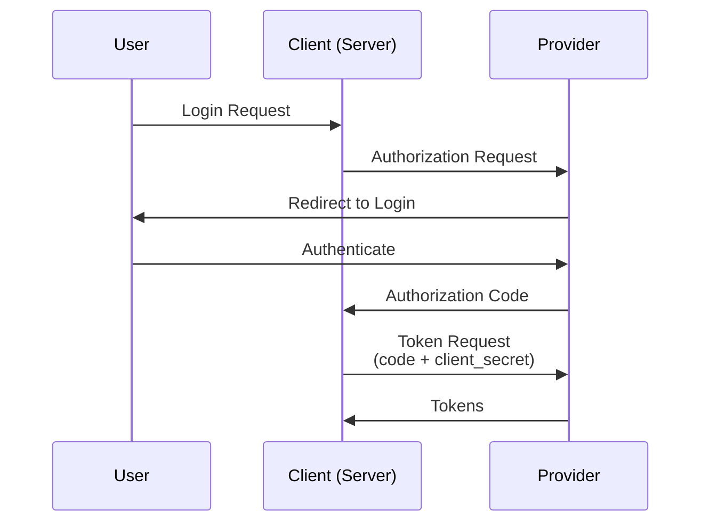
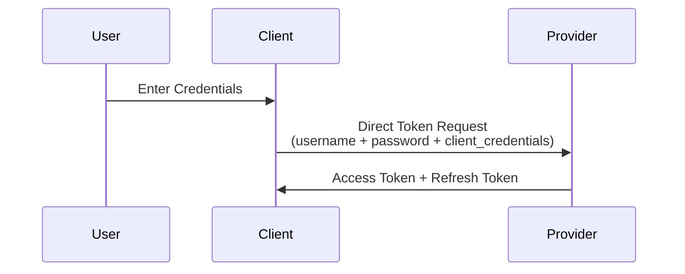
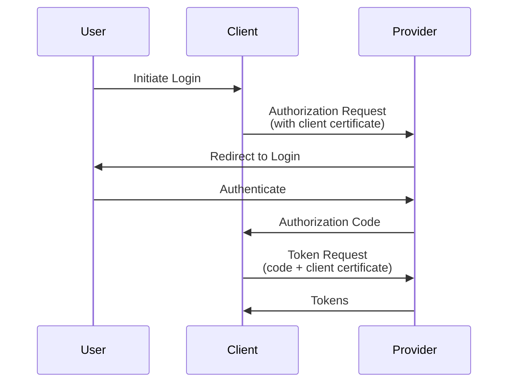
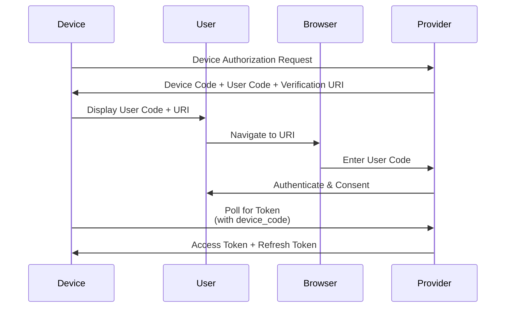
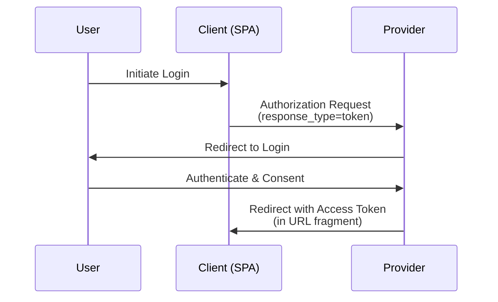
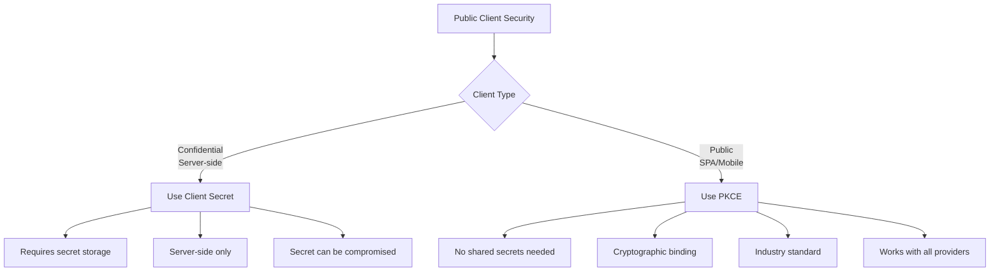
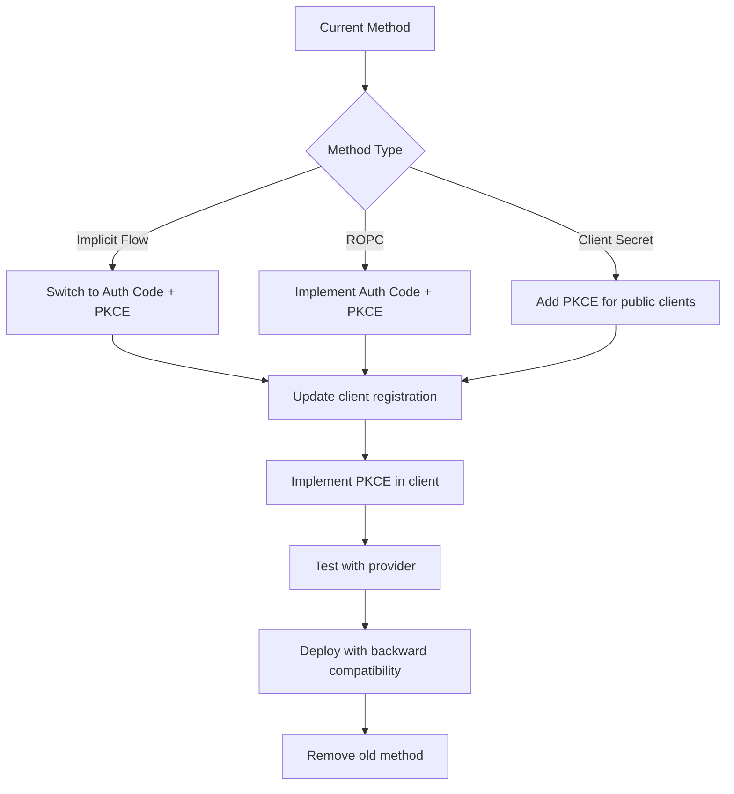

This implementation ensures that all OAuth2/OIDC flows in the application are protected by PKCE, providing robust security for modern authentication scenarios.

## Alternatives to PKCE

While PKCE is the recommended security enhancement for OAuth2/OIDC, especially for public clients, there are alternative approaches depending on your use case and client type:

### 1. Client Secret (Confidential Clients)

**Best for**: Server-side applications, backend services, daemon apps



**Pros**:
- No additional complexity
- Secure for confidential clients
- No PKCE needed

**Cons**:
- Requires secure storage of client_secret
- Not suitable for public clients (SPAs, mobile apps)
- Client secret can be compromised

**When to use**: Traditional web applications with secure backend

### 2. Resource Owner Password Credentials (ROPC) Flow

**Best for**: Highly trusted first-party applications



**Pros**:
- No redirects required
- Simple implementation
- Works for native apps

**Cons**:
- User credentials exposed to client
- No consent flow
- Deprecated by OAuth2 Security Best Current Practice
- Phishing vulnerability

**When to use**: Legacy systems, highly trusted environments (not recommended for new implementations)

### 3. Client Certificates (Mutual TLS)

**Best for**: Enterprise applications requiring strong authentication



**Pros**:
- Strong mutual authentication
- No shared secrets
- Regulatory compliance (financial, healthcare)

**Cons**:
- Complex certificate management
- Higher operational overhead
- Not supported by all providers

**When to use**: Financial services, healthcare, high-security enterprise apps

### 4. Device Code Flow

**Best for**: Smart TVs, gaming consoles, IoT devices



**Pros**:
- No redirect URI needed
- Works for input-constrained devices
- User-friendly for shared devices

**Cons**:
- Requires polling mechanism
- User must use separate device/browser
- Still uses PKCE in some implementations

**When to use**: Smart TVs, gaming consoles, CLI tools

### 5. Implicit Flow (Deprecated)

**Status**: Deprecated by OAuth2 Security Best Current Practice (RFC 6749)



**Pros**:
- Simple for SPAs
- No server-side token exchange

**Cons**:
- **Deprecated**: Security vulnerabilities
- Tokens exposed in browser history/URL
- No refresh tokens
- Vulnerable to token interception

**When to use**: Never (use Authorization Code + PKCE instead)

### Comparison of Alternatives

| Method | Client Type | Security Level | Complexity | Recommendation |
|--------|-------------|----------------|------------|----------------|
| **PKCE** | Public | High | Medium | ✅ Recommended for all public clients |
| Client Secret | Confidential | High | Low | ✅ For server-side apps |
| ROPC | Any | Low | Low | ❌ Avoid for new implementations |
| Client Certificates | Any | Very High | High | ✅ For high-security requirements |
| Device Code | Input-limited | Medium | Medium | ✅ For IoT/smart devices |
| Implicit | Public | Low | Low | ❌ Deprecated, use PKCE instead |

### Why PKCE is Still the Best Choice



**Key Reasons to Choose PKCE**:
1. **No Secrets Required**: Perfect for public clients where secrets can't be stored securely
2. **Industry Standard**: Required by OAuth2 Security Best Current Practice
3. **Universal Support**: All major providers support PKCE
4. **Future-Proof**: Works with modern browsers and mobile platforms
5. **Cryptographically Secure**: Uses SHA256 for proof-of-possession

### Migration from Alternatives to PKCE

If you're using an alternative method and want to migrate to PKCE:



This ensures your application uses the most secure and appropriate authentication method for its client type and use case.

## How to Implement PKCE in Your Client

Implementing PKCE in your client application involves modifying both the authorization request and token exchange. Here's a step-by-step guide:

### Step 1: Generate PKCE Pair

First, generate a cryptographically secure code_verifier and its corresponding code_challenge:

```javascript
// JavaScript/TypeScript example
function generatePKCEPair() {
    // Generate random code_verifier (43-128 characters)
    const codeVerifier = generateRandomString(64);
    
    // Create code_challenge using SHA256
    const encoder = new TextEncoder();
    const data = encoder.encode(codeVerifier);
    const hash = await crypto.subtle.digest('SHA-256', data);
    const codeChallenge = base64URLEncode(hash);
    
    return { codeVerifier, codeChallenge };
}

function generateRandomString(length) {
    const chars = 'ABCDEFGHIJKLMNOPQRSTUVWXYZabcdefghijklmnopqrstuvwxyz0123456789-._~';
    let result = '';
    for (let i = 0; i < length; i++) {
        result += chars.charAt(Math.floor(Math.random() * chars.length));
    }
    return result;
}

function base64URLEncode(buffer) {
    const base64 = btoa(String.fromCharCode(...new Uint8Array(buffer)));
    return base64.replace(/\+/g, '-').replace(/\//g, '_').replace(/=/g, '');
}
```

```python
# Python example
import secrets
import hashlib
import base64

def generate_pkce_pair():
    """Generate PKCE code_verifier and code_challenge."""
    code_verifier = secrets.token_urlsafe(32)  # 43 chars
    code_challenge = base64.urlsafe_b64encode(
        hashlib.sha256(code_verifier.encode()).digest()
    ).decode().rstrip('=')
    return code_verifier, code_challenge
```

### Step 2: Store Code Verifier

Store the code_verifier securely, associated with the OAuth2 state parameter:

```javascript
// JavaScript - Store in sessionStorage (for SPAs)
const state = generateState(); // Your OAuth2 state
const { codeVerifier, codeChallenge } = await generatePKCEPair();

// Store verifier keyed by state
sessionStorage.setItem(`pkce_${state}`, codeVerifier);
```

```python
# Python - Using your PKCE store
from your_pkce_store import store_pkce_verifier

state = secrets.token_hex(16)
code_verifier, code_challenge = generate_pkce_pair()
store_pkce_verifier(state, code_verifier)
```

### Step 3: Include in Authorization Request

Add the code_challenge and code_challenge_method to your authorization URL:

```javascript
// Build authorization URL
const authUrl = `${authorizationEndpoint}?` + new URLSearchParams({
    client_id: 'your-client-id',
    response_type: 'code',
    scope: 'openid profile email',
    redirect_uri: 'https://yourapp.com/callback',
    state: state,
    code_challenge: codeChallenge,
    code_challenge_method: 'S256'
});

// Redirect user to authorization endpoint
window.location.href = authUrl;
```

### Step 4: Handle Token Exchange

Retrieve the stored code_verifier and include it in the token request:

```javascript
// In your callback handler
const urlParams = new URLSearchParams(window.location.search);
const code = urlParams.get('code');
const state = urlParams.get('state');

// Retrieve stored verifier
const codeVerifier = sessionStorage.getItem(`pkce_${state}`);
sessionStorage.removeItem(`pkce_${state}`); // One-time use

if (!codeVerifier) {
    throw new Error('PKCE verifier not found or expired');
}

// Exchange code for tokens
const tokenResponse = await fetch(tokenEndpoint, {
    method: 'POST',
    headers: {
        'Content-Type': 'application/x-www-form-urlencoded',
    },
    body: new URLSearchParams({
        grant_type: 'authorization_code',
        code: code,
        client_id: 'your-client-id',
        client_secret: 'your-client-secret', // If confidential client
        redirect_uri: 'https://yourapp.com/callback',
        code_verifier: codeVerifier
    })
});

const tokens = await tokenResponse.json();
// tokens: { access_token, id_token, refresh_token }
```

### Complete Client Implementation Example

```javascript
// Complete SPA example
class OAuthClient {
    constructor(config) {
        this.config = config;
    }

    async initiateLogin() {
        const state = this.generateState();
        const { codeVerifier, codeChallenge } = await this.generatePKCEPair();
        
        // Store verifier
        sessionStorage.setItem(`pkce_${state}`, codeVerifier);
        
        // Build auth URL
        const authUrl = this.buildAuthUrl(state, codeChallenge);
        
        // Redirect
        window.location.href = authUrl;
    }

    async handleCallback() {
        const urlParams = new URLSearchParams(window.location.search);
        const code = urlParams.get('code');
        const state = urlParams.get('state');
        
        if (!code || !state) {
            throw new Error('Missing authorization code or state');
        }
        
        // Retrieve and remove verifier
        const codeVerifier = sessionStorage.getItem(`pkce_${state}`);
        sessionStorage.removeItem(`pkce_${state}`);
        
        if (!codeVerifier) {
            throw new Error('PKCE verifier expired or invalid');
        }
        
        // Exchange for tokens
        const tokens = await this.exchangeCodeForTokens(code, codeVerifier);
        
        return tokens;
    }

    async generatePKCEPair() {
        const codeVerifier = this.generateRandomString(64);
        const codeChallenge = await this.generateCodeChallenge(codeVerifier);
        return { codeVerifier, codeChallenge };
    }

    async generateCodeChallenge(codeVerifier) {
        const encoder = new TextEncoder();
        const data = encoder.encode(codeVerifier);
        const hash = await crypto.subtle.digest('SHA-256', data);
        return this.base64URLEncode(hash);
    }

    generateRandomString(length) {
        const chars = 'ABCDEFGHIJKLMNOPQRSTUVWXYZabcdefghijklmnopqrstuvwxyz0123456789-._~';
        return Array.from(crypto.getRandomValues(new Uint8Array(length)))
            .map(byte => chars[byte % chars.length])
            .join('');
    }

    base64URLEncode(buffer) {
        const base64 = btoa(String.fromCharCode(...new Uint8Array(buffer)));
        return base64.replace(/\+/g, '-').replace(/\//g, '_').replace(/=/g, '');
    }

    generateState() {
        return this.generateRandomString(32);
    }

    buildAuthUrl(state, codeChallenge) {
        const params = new URLSearchParams({
            client_id: this.config.clientId,
            response_type: 'code',
            scope: this.config.scope,
            redirect_uri: this.config.redirectUri,
            state: state,
            code_challenge: codeChallenge,
            code_challenge_method: 'S256'
        });
        
        return `${this.config.authorizationEndpoint}?${params}`;
    }

    async exchangeCodeForTokens(code, codeVerifier) {
        const response = await fetch(this.config.tokenEndpoint, {
            method: 'POST',
            headers: {
                'Content-Type': 'application/x-www-form-urlencoded',
            },
            body: new URLSearchParams({
                grant_type: 'authorization_code',
                code: code,
                client_id: this.config.clientId,
                client_secret: this.config.clientSecret,
                redirect_uri: this.config.redirectUri,
                code_verifier: codeVerifier
            })
        });
        
        if (!response.ok) {
            throw new Error('Token exchange failed');
        }
        
        return await response.json();
    }
}
```

## Provider Portal Configuration

Most OAuth2/OIDC providers enable PKCE by default, but some require explicit configuration:

### Azure AD
- **Portal**: Azure Portal → App Registrations
- **Setting**: Authentication → Implicit grant and hybrid flows
- **PKCE**: Enabled by default for all apps
- **Additional**: No special configuration needed

### Google OAuth2
- **Portal**: Google Cloud Console → APIs & Services → Credentials
- **Setting**: OAuth 2.0 Client IDs
- **PKCE**: Automatically supported
- **Additional**: Ensure "Authorized redirect URIs" are configured

### GitHub
- **Portal**: GitHub → Settings → Developer settings → OAuth Apps
- **Setting**: Register new OAuth application
- **PKCE**: Supported automatically
- **Additional**: No PKCE-specific settings needed

### Auth0
- **Portal**: Auth0 Dashboard → Applications
- **Setting**: Application settings
- **PKCE**: Enabled by default
- **Additional**: Can configure "OIDC Conformant" mode

### Okta
- **Portal**: Okta Admin Console → Applications
- **Setting**: Application settings
- **PKCE**: Supported by default
- **Additional**: Ensure proper grant types are enabled

### General Requirements
1. **HTTPS Required**: Most providers require HTTPS for PKCE-enabled apps
2. **Redirect URIs**: Must be pre-registered with the provider
3. **Grant Types**: Authorization Code grant must be enabled
4. **Scopes**: Appropriate scopes must be configured

### Testing PKCE Implementation

```javascript
// Test your PKCE implementation
async function testPKCE() {
    const client = new OAuthClient({
        clientId: 'your-test-client-id',
        clientSecret: 'your-test-client-secret',
        authorizationEndpoint: 'https://provider.com/oauth/authorize',
        tokenEndpoint: 'https://provider.com/oauth/token',
        redirectUri: 'https://yourapp.com/callback',
        scope: 'openid profile email'
    });

    // Test PKCE pair generation
    const { codeVerifier, codeChallenge } = await client.generatePKCEPair();
    console.log('Code Verifier:', codeVerifier);
    console.log('Code Challenge:', codeChallenge);
    
    // Verify challenge is SHA256 hash of verifier
    const expectedChallenge = await client.generateCodeChallenge(codeVerifier);
    console.assert(codeChallenge === expectedChallenge, 'PKCE pair generation failed');
    
    console.log('PKCE implementation test passed!');
}
```

### Common Implementation Pitfalls

1. **Storing Verifier Insecurely**: Never store in localStorage (persists across sessions)
2. **Reusing Verifier**: Always use one-time retrieval to prevent replay attacks
3. **Missing State Association**: Always associate verifier with OAuth2 state
4. **Incorrect Base64 Encoding**: Use URL-safe base64 without padding
5. **Wrong Hash Algorithm**: Must use SHA256 for code_challenge_method

### Security Best Practices

1. **Secure Storage**: Use sessionStorage for SPAs, secure server-side storage for web apps
2. **One-Time Use**: Remove verifier after successful token exchange
3. **State Validation**: Always validate OAuth2 state parameter
4. **HTTPS Only**: Never use PKCE with HTTP (violates security requirements)
5. **Regular Testing**: Test PKCE flow regularly with your provider

This implementation ensures your client application uses PKCE correctly for secure OAuth2/OIDC authentication.
