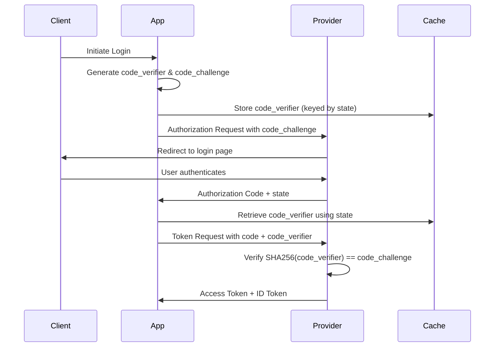
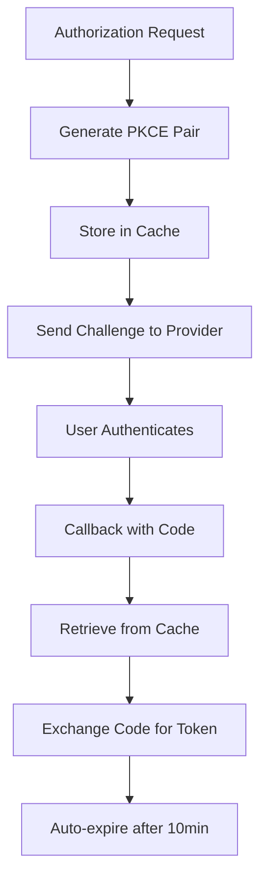
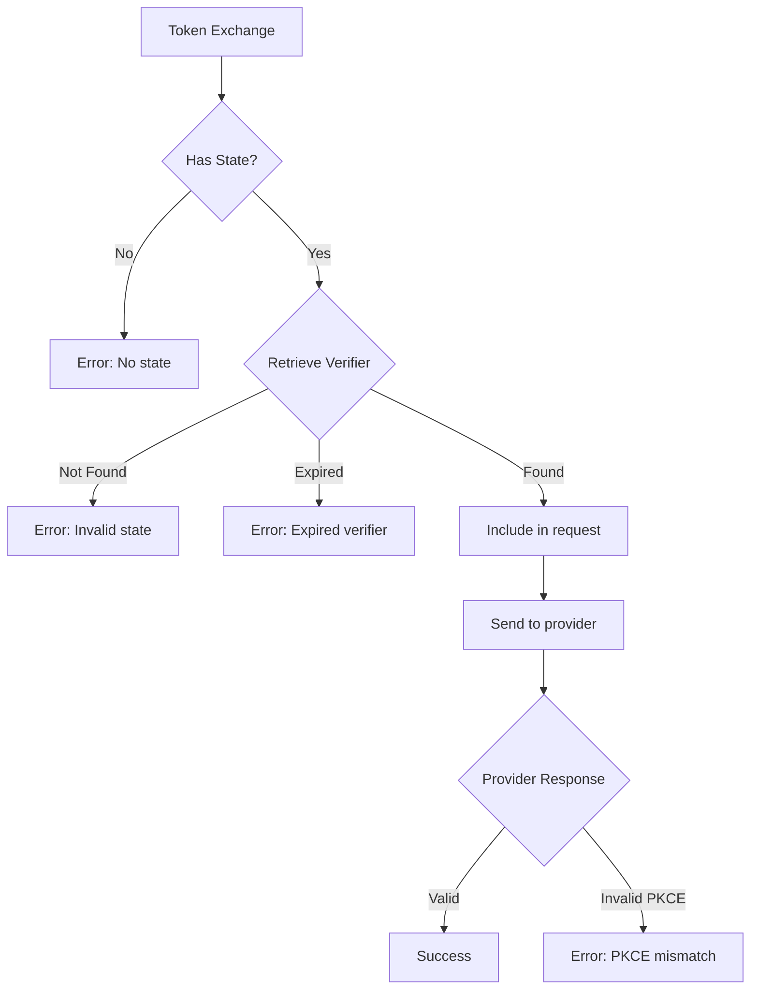
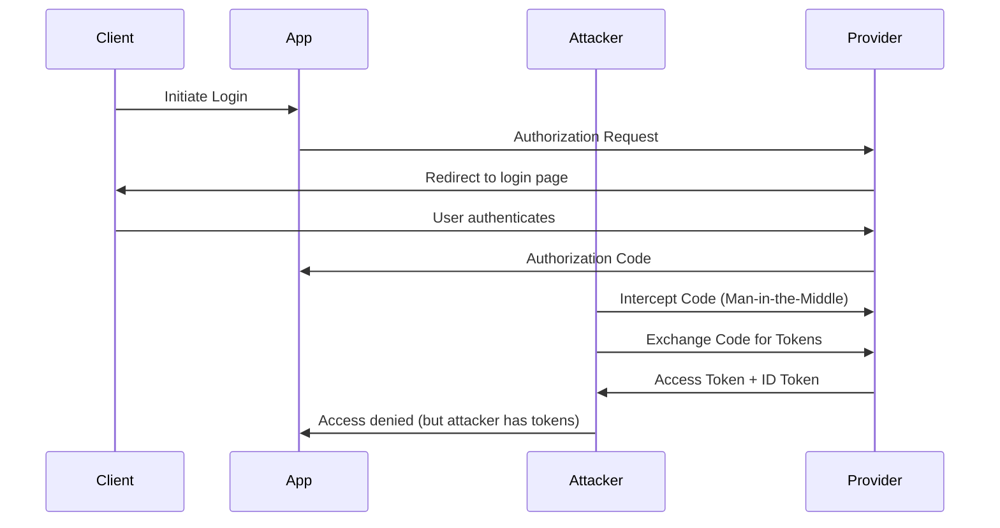
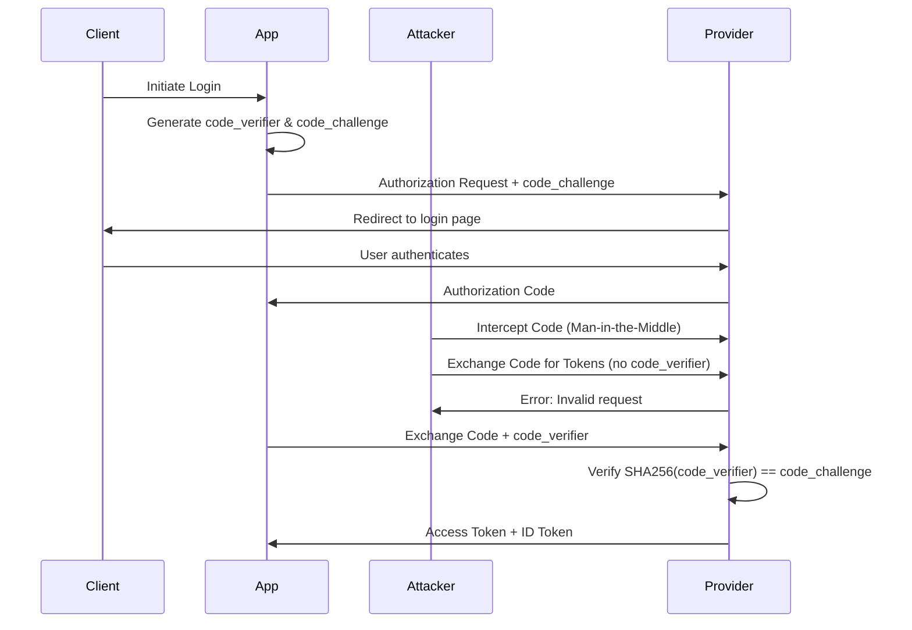
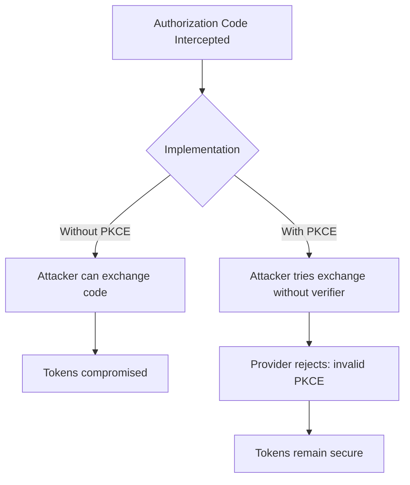
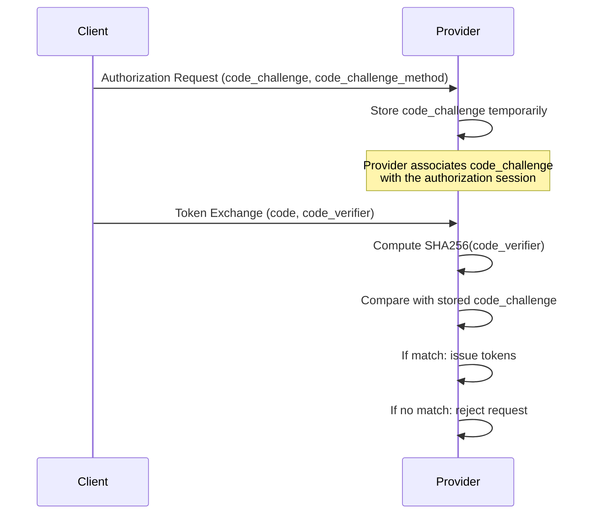
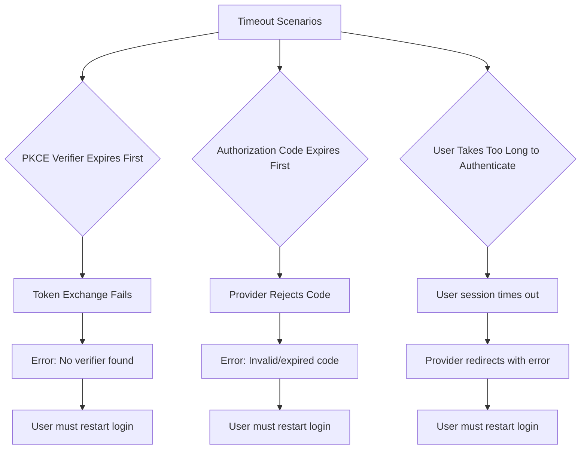
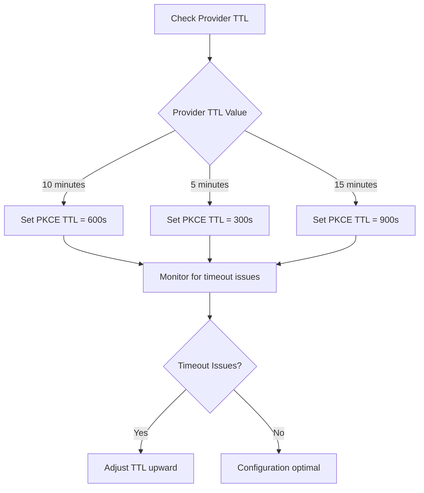

# PKCE Implementation in OIDC OAuth2

## Overview

This document explains how Proof Key for Code Exchange (PKCE) is implemented and used in this OIDC OAuth2 implementation project. PKCE enhances security for public clients by preventing authorization code interception attacks.

## What is PKCE?

PKCE (Proof Key for Code Exchange) is an OAuth 2.0 security extension that protects against authorization code interception attacks. It works by:

1. **Code Verifier**: A cryptographically random string generated by the client
2. **Code Challenge**: A SHA256 hash of the code verifier sent in the authorization request
3. **Verification**: The provider verifies the code challenge matches the code verifier during token exchange

### Why PKCE is Important

- **Prevents Code Interception**: Even if an attacker intercepts the authorization code, they cannot exchange it for tokens without the code verifier
- **Public Client Security**: Essential for mobile apps, SPAs, and desktop applications
- **RFC 7636 Standard**: Industry-standard security enhancement

## PKCE Flow in This Implementation



## Implementation Details

### 1. PKCE Pair Generation

The `generate_pkce_pair()` function creates a secure code verifier and challenge:

```python
def generate_pkce_pair() -> tuple[str, str]:
    """Generate PKCE code_verifier and code_challenge."""
    code_verifier = secrets.token_urlsafe(32)  # 43 chars
    code_challenge = base64.urlsafe_b64encode(
        hashlib.sha256(code_verifier.encode()).digest()
    ).decode().rstrip('=')
    return code_verifier, code_challenge
```

### 2. Storage Mechanism

Code verifiers are stored securely using an in-memory cache with TTL:



### 3. Authorization URL Building

In `build_login_redirect_url()`, PKCE is automatically included:

```python
if self.use_pkce:
    code_verifier, code_challenge = generate_pkce_pair()
    get_pkce_store().store(state, code_verifier)
    params["code_challenge"] = code_challenge
    params["code_challenge_method"] = "S256"
```

### 4. Token Exchange

During callback, the code verifier is retrieved and sent:

```python
if self.use_pkce and state:
    code_verifier = get_pkce_store().retrieve(state)
    if code_verifier:
        data["code_verifier"] = code_verifier
```

## Security Features

### One-Time Use
- Code verifiers are retrieved using `cache.pop()` - ensuring one-time use
- Prevents replay attacks

### Automatic Expiration
- 10-minute TTL prevents memory leaks and enforces timeliness
- Expired verifiers cannot be used

### State Binding
- Verifiers are keyed by the OAuth2 state parameter
- Provides additional CSRF protection

## Configuration

PKCE is enabled by default in all OIDC clients:

```python
client = GenericOIDCClient(
    client_id="...",
    client_secret="...",
    redirect_uri="...",
    token_endpoint="...",
    authorization_endpoint="...",
    use_pkce=True  # Default: True
)
```

## Error Handling



## Testing PKCE

The implementation includes comprehensive tests ensuring:

- Verifiers are stored and retrieved correctly
- One-time use prevents reuse
- Expiration works as expected
- Invalid states return None

## Benefits in This Project

1. **Enterprise Security**: Protects against code interception in production
2. **Multi-Platform**: Works for web, mobile, and desktop clients
3. **Standards Compliant**: Follows RFC 7636 specifications
4. **Automatic**: No manual configuration required - enabled by default
5. **Scalable**: In-memory cache with TTL for high-throughput scenarios

## Related Components

- `src/core/auth/pkce_store.py` - PKCE storage implementation
- `src/core/auth/oidc_client.py` - OIDC client with PKCE integration
- `src/core/cache/memory_cache.py` - Underlying cache mechanism

This implementation ensures that all OAuth2/OIDC flows in the application are protected by PKCE, providing robust security for modern authentication scenarios.

## Comparison: With vs Without PKCE

To understand the security enhancement PKCE provides, let's compare the authorization code flow with and without PKCE.

### Without PKCE (Vulnerable)



**Vulnerability**: The authorization code can be intercepted and used by an attacker to obtain tokens, as there's no binding between the authorization request and the token exchange.

### With PKCE (Secure)



**Protection**: Even if the authorization code is intercepted, the attacker cannot exchange it for tokens without the secret code_verifier, which is never transmitted over the network.

### Key Differences

| Aspect | Without PKCE | With PKCE |
|--------|-------------|-----------|
| **Authorization Request** | Standard OAuth2 parameters | Includes `code_challenge` and `code_challenge_method` |
| **Client Secret Required** | No (public clients) | No (but code_verifier acts as dynamic secret) |
| **Token Exchange** | `code` + `client_id` + `client_secret` | `code` + `client_id` + `client_secret` + `code_verifier` |
| **Security** | Vulnerable to code interception | Protected against interception attacks |
| **Implementation Complexity** | Simple | Requires secure storage of code_verifier |
| **RFC Compliance** | OAuth 2.0 (RFC 6749) | OAuth 2.0 Security Best Current Practice (RFC 7636) |

### Attack Scenario Prevention



This comparison demonstrates why PKCE is essential for public clients and recommended for all OAuth 2.0 implementations, especially in modern web and mobile applications where client secrets cannot be securely stored.

## How the Provider Verifies PKCE

A common question is: "How does the OAuth provider know the code_verifier if it's never sent during the authorization request?"

The answer lies in the verification process during token exchange. Here's how it works:

### Provider's Perspective



### Step-by-Step Verification

1. **Authorization Request**: Client sends `code_challenge` (SHA256 hash of `code_verifier`)
2. **Provider Storage**: Provider stores the `code_challenge` linked to the authorization code
3. **Token Exchange**: Client sends the actual `code_verifier` along with the authorization code
4. **Verification**: Provider computes `SHA256(code_verifier)` and compares it to the stored `code_challenge`
5. **Decision**: If they match, tokens are issued; if not, the request is rejected

### Why This Works

- **No Pre-shared Secret**: The provider doesn't need to know the verifier beforehand
- **Cryptographic Binding**: The hash ensures only the correct verifier will match
- **One-Way Function**: SHA256 prevents deriving the verifier from the challenge
- **Temporal Binding**: The challenge is only valid for the specific authorization session

### Implementation in Token Endpoint

When the provider receives the token exchange request:

```python
# Pseudocode for provider's token endpoint
def exchange_code_for_token(code, code_verifier, client_id, ...):
    # Retrieve stored code_challenge for this code
    stored_challenge = get_stored_challenge(code)

    # Compute hash of received verifier
    computed_challenge = base64.urlsafe_b64encode(
        hashlib.sha256(code_verifier.encode()).digest()
    ).decode().rstrip('=')

    # Verify they match
    if computed_challenge == stored_challenge:
        return issue_tokens()
    else:
        return error("Invalid PKCE verifier")
```

This verification ensures that only the legitimate client that initiated the authorization request can exchange the code for tokens, even if the code itself is intercepted.

## PKCE Timeout and TTL Considerations

### What Happens If Timeout Occurs?

Timeouts can occur at different stages of the PKCE flow, each with different consequences:



### Default Timeout Values

#### PKCE Verifier TTL
- **Default**: 600 seconds (10 minutes)
- **Reasoning**: Allows sufficient time for user authentication while preventing memory leaks
- **Implementation**: Set in `PKCE_TTL_SECONDS = 600`

#### Typical Provider Authorization Code TTL
- **Google**: 10 minutes
- **Azure AD**: 10 minutes
- **Auth0**: 10 minutes
- **GitHub**: 10 minutes
- **Varies by provider**: Check documentation for specific values

### Matching TTL Values

To ensure smooth operation, the PKCE verifier TTL should be configured to match or exceed the provider's authorization code TTL:

```python
# Recommended configuration
PKCE_TTL_SECONDS = 600  # 10 minutes - matches most providers

# For providers with longer TTL (rare)
PKCE_TTL_SECONDS = 900  # 15 minutes

# For providers with shorter TTL (if any)
PKCE_TTL_SECONDS = 300  # 5 minutes - but verify provider TTL first
```

#### TTL Matching Strategy



### Configuration by Provider

Different providers may have different authorization code lifetimes. Here's how to configure PKCE TTL accordingly:

| Provider | Typical Code TTL | Recommended PKCE TTL | Notes |
|----------|------------------|----------------------|-------|
| Google | 10 minutes | 600s | Default works |
| Azure AD | 10 minutes | 600s | Default works |
| Auth0 | 10 minutes | 600s | Default works |
| GitHub | 10 minutes | 600s | Default works |
| Okta | 5 minutes | 300s | Shorter TTL |
| Custom Provider | Check docs | Match provider | Verify with provider |

### Handling Timeout Errors

When timeouts occur, the application should:

1. **Log the timeout reason** for monitoring
2. **Clear any cached state** to prevent inconsistencies
3. **Redirect user to restart** the authentication flow
4. **Provide user-friendly error message**

```python
# Example error handling in callback
if not code_verifier:
    logger.warning(f"PKCE verifier expired for state: {state}")
    # Clear any remaining state
    # Redirect to login with timeout message
```

### Best Practices

1. **Monitor timeout rates** - High rates may indicate TTL mismatch
2. **Set PKCE TTL slightly longer** than provider TTL to account for network delays
3. **Implement retry logic** with exponential backoff if needed
4. **Document TTL values** in deployment configurations
5. **Test with each provider** during integration

This ensures reliable authentication flows while maintaining security through appropriate timeout management.

