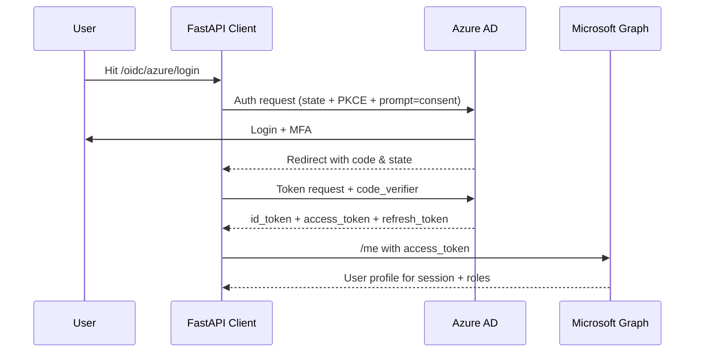
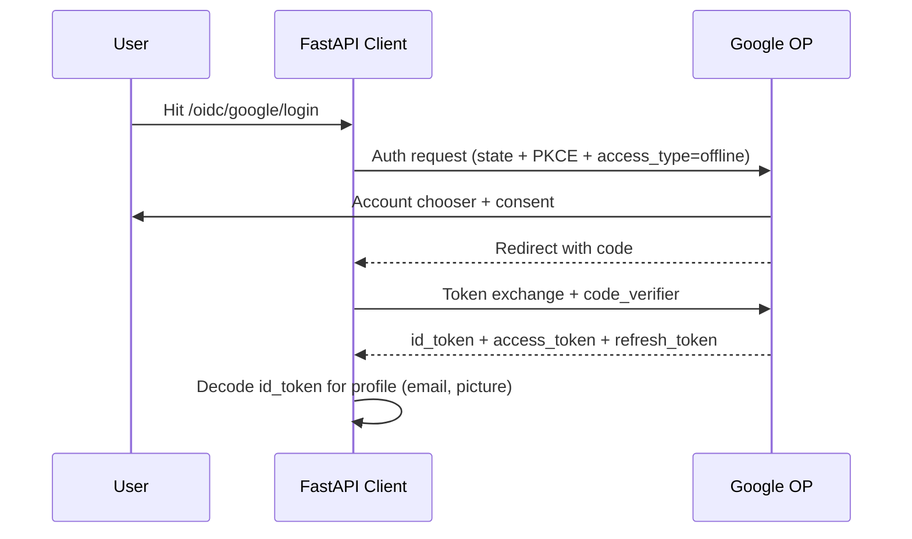
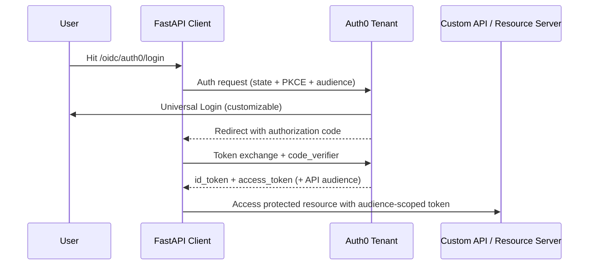
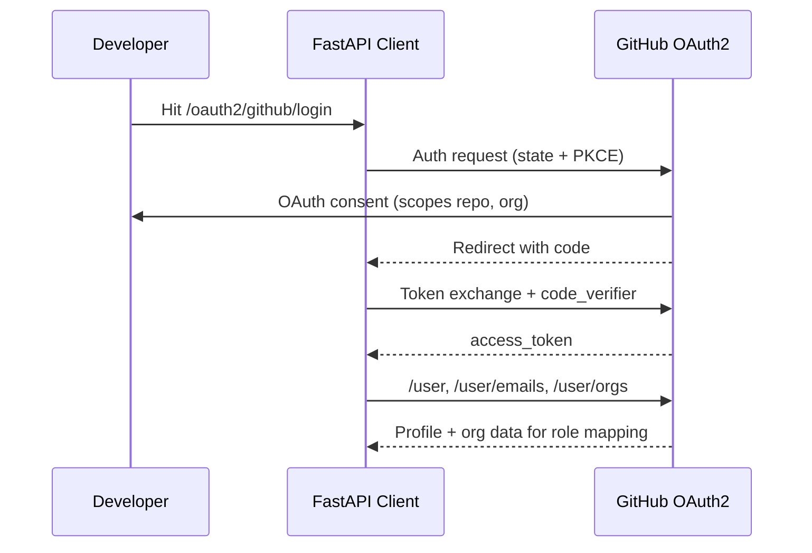
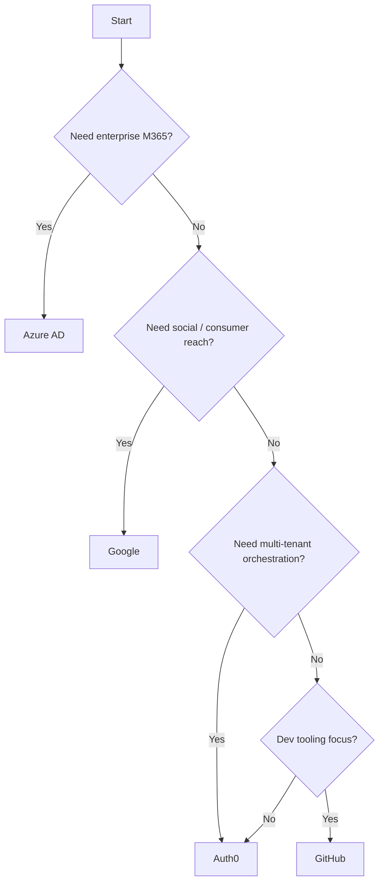

# Identity Provider Implementation Guide

This guide explains how each supported provider is wired into the FastAPI stack, what it is best suited for, and how to choose between them. Code references point to the concrete service classes in `src/fastapi/services/auth/`.

---

## Quick Feature Matrix

| Provider | Protocols | Tokens Returned | PKCE | Refresh Token Support | User Info Source | Typical Tenants |
|----------|-----------|-----------------|------|-----------------------|------------------|-----------------|
| **Azure AD** | OAuth2 + OIDC | `access_token`, `id_token`, `refresh_token` | ✅ | ✅ (`offline_access`) | Microsoft Graph | Enterprise / M365 orgs |
| **Google** | OAuth2 + OIDC | `access_token`, `id_token`, `refresh_token` | ✅ | ✅ (`access_type=offline`) | Google UserInfo API | Consumer & Workspace apps |
| **Auth0** | OAuth2 + OIDC | `access_token`, `id_token`, `refresh_token` | ✅ | ✅ (`offline_access`) | Auth0 UserInfo or ID token | Multi-tenant SaaS |
| **GitHub** | OAuth2 only | `access_token` | ✅ | ❌ | GitHub REST API | Dev tooling & CI/CD |

---

## Azure Active Directory (`AzureAuthService`)

**Code reference:** `src/fastapi/services/auth/azure_service.py`

### Implementation Highlights
- Uses `GenericOIDCClient` with scopes from settings; injects `offline_access` and `prompt=consent` to guarantee refresh tokens.
- Validates tokens via `OIDCTokenValidator` using Azure JWKS (`/.well-known/openid-configuration`).
- Fetches profile data from Microsoft Graph (`https://graph.microsoft.com/v1.0/me`) for rich org context.
- Auto-detects HTTP proxy settings for corporate networks.

### Flow

### Pros
- Deep Microsoft 365 / Entra ID integration (groups, tenants, hybrid join).
- Enterprise-grade security defaults (Conditional Access, MFA, CAE).
- Stable refresh tokens for service-to-service calls.

### Cons
- Complex app registration (multiple redirect URIs, consent settings).
- Requires tenant admin consent for higher privileges.
- Token size can be large because of group claims.

### Best Fit
Use Azure AD when targeting corporate tenants, zero-trust intranets, or hybrid cloud workloads that already rely on Microsoft identities.

---

## Google Identity (`GoogleAuthService`)

**Code reference:** `src/fastapi/services/auth/google_service.py`

### Implementation Highlights
- Registers PKCE-enabled `GenericOIDCClient` with `prompt=consent` and `access_type=offline` for refresh tokens.
- Validates ID tokens with Google JWKS and falls back to the UserInfo endpoint when needed.
- Supports both consumer and Google Workspace accounts seamlessly.

### Flow

### Pros
- Fast setup, minimal portal configuration.
- High-quality identity data (verified email, avatar, locale).
- Global infrastructure with built-in anti-abuse checks.

### Cons
- Strict branding review for production consent screens.
- Some enterprise domains block external apps.
- Workspace admins can throttle refresh-token issuance.

### Best Fit
Choose Google for consumer-facing apps, lightweight SaaS onboarding, or when email verification plus social sign-in is critical.

---

## Auth0 (`Auth0AuthService`)

**Code reference:** `src/fastapi/services/auth/auth0_service.py`

### Implementation Highlights
- Leverages `GenericOIDCClient` with dynamic `audience` support to request API access tokens.
- Always appends `offline_access` to scopes; uses Auth0 JWKS for ID-token validation.
- Decodes ID tokens locally (with optional fallback to `/userinfo`) for multi-tenant SaaS mapping.

### Flow

### Pros
- Unified login across social, enterprise, and passwordless providers.
- Rule/Action engine for progressive profiling and MFA policies.
- Easy to segment tenants with custom domains and audiences.

### Cons
- Paid tiers for advanced features (Actions, SSO).
- Vendor lock-in for rules, Adaptive MFA, and log streaming.
- Requires careful rate-limit planning for large orgs.

### Best Fit
Select Auth0 for multi-tenant SaaS platforms needing flexible identity orchestration, rapid prototyping, or when you must mix social + enterprise providers quickly.

---

## GitHub (`GitHubAuthService`)

**Code reference:** `src/fastapi/services/auth/github_service.py`

### Implementation Highlights
- Implements OAuth2-only flow via `GenericOIDCClient`; GitHub does **not** issue ID tokens.
- Fetches additional metadata (emails, organizations) via REST endpoints to drive RBAC.
- Still benefits from PKCE and state validation for security.

### Flow

### Pros
- Perfect for dev tooling, CI/CD dashboards, and GitOps utilities.
- Easy app registration; scopes align with repos/orgs.
- Strong PKCE protection without managing ID tokens.

### Cons
- No ID token or refresh token support.
- Access tokens expire quickly; requires re-auth or app tokens.
- Limited identity data (no phone, no verified profile claims).

### Best Fit
Use GitHub when integrating with developer workflows, repository permissions, or when GitHub org membership maps directly to your app roles.

---

## How to Choose the Right Provider

- **Regulated enterprise →** Azure AD
- **Consumer & SMB SaaS →** Google or Auth0
- **Multi-tenant & BYOID →** Auth0
- **Developer ecosystems →** GitHub

Use this document alongside `README.md` and `OIDC_OAuth2_Flows.md` when planning new provider integrations.

