# OAuth2 / OIDC Implementation with FastAPI

> A comprehensive demonstration of OAuth2 and OpenID Connect (OIDC) authentication flows with session tracking, role-based access control, and extensible provider architecture.

---

## 📋 Table of Contents

1. [🎯 Introduction](#-introduction)
2. [🐳 Quick Start with Docker](#-quick-start-with-docker)
3. [🔐 OAuth2 vs OIDC](#-oauth2-vs-oidc)
4. [🏗️ Architecture Overview](#️-architecture-overview)
5. [🧩 Core Auth Module](#-core-auth-module)
6. [🏭 Provider Factory Pattern](#-provider-factory-pattern)
7. [🔒 PKCE Security Implementation](#-pkce-security-implementation)
8. [💾 Cache Usage](#-cache-usage)
9. [🗄️ Database Logging & Session Tracking](#️-database-logging--session-tracking)
10. [👥 Role Service](#-role-service)
11. [📊 Flow Diagrams](#-flow-diagrams)
12. [🚀 API Endpoints](#-api-endpoints)
13. [⚙️ Provider Implementation Guide](#️-provider-implementation-guide)
14. [🔧 Setup & Configuration](#-setup--configuration)

---

## 🎯 Introduction

This project demonstrates the practical differences between **OAuth2** and **OpenID Connect (OIDC)** protocols using a modular, extensible architecture. It supports multiple identity providers with comprehensive session tracking and role-based access control.

### Supported Providers

| Provider | Protocol Support | Tokens Returned | Session Tracking |
|----------|------------------|-----------------|------------------|
| **GitHub** | OAuth2 Only | `access_token` | ✅ |
| **Azure AD** | OAuth2 + OIDC | `access_token` + `id_token` + `refresh_token` | ✅ |
| **Google** | OAuth2 + OIDC | `access_token` + `id_token` + `refresh_token` | ✅ |
| **Auth0** | OAuth2 + OIDC | `access_token` + `id_token` + `refresh_token` | ✅ |

---

## 🐳 Quick Start with Docker

The easiest way to run this project is using Docker. This will set up both the FastAPI application and PostgreSQL database automatically.

### Prerequisites
- Docker (20.10+)
- Docker Compose (2.0+)

### Start the Application

```bash
# Development mode (hot reload - code changes auto-refresh!)
make dev

# Or use docker-compose directly (dev mode is default)
docker-compose up

# Production mode (optimized)
make prod
```

**✨ Hot Reload Enabled**: Edit your code → Save → See changes instantly (no rebuild!)

### Access the Application

- **API Documentation**: http://localhost:8001/docs
- **Alternative Docs**: http://localhost:8001/redoc
- **Health Check**: http://localhost:8001/health

### Development Workflow

```bash
# 1. Start development environment
make dev

# 2. Edit code (auto-reloads!)
vim src/core/auth/oidc_client.py

# 3. View logs in another terminal
make logs-app

# 4. Test immediately at http://localhost:8001/docs
```

### Cross-Platform Commands

Works identically on **Mac, Windows, and Linux**:

```bash
# Essential commands
make dev        # Start with hot reload
make prod       # Start optimized
make logs       # View all logs
make logs-app   # View app logs only
make shell      # Access app container
make shell-db   # Access database
make health     # Check health
make down       # Stop services
make clean-all  # Full cleanup
```

### Mode Configuration

Add to `.env` to control behavior:

```bash
# Development (default)
DOCKER_MODE=dev
DEBUG=true
LOG_LEVEL=DEBUG

# Production
DOCKER_MODE=prod
DEBUG=false
LOG_LEVEL=WARNING
```

### Configuration

Add to `.env`:
```bash
DOCKER_MODE=dev    # or "prod"
DEBUG=true
LOG_LEVEL=DEBUG
```

**Full Docker guide:** See [DOCKER.md](DOCKER.md)

---

## 🔐 OAuth2 vs OIDC

### OAuth2 - Authorization Protocol

OAuth2 is an **authorization** framework for obtaining limited access to user accounts on HTTP services.

**Key Characteristics:**
- Returns `access_token` for API access
- Token format is opaque (not a JWT)
- **Requires API call** to get user information
- No built-in token refresh capability
- No standardized user identity claims

### OIDC - Authentication Protocol

OpenID Connect adds an **authentication** layer on top of OAuth2, making it suitable for Single Sign-On (SSO).

**Key Characteristics:**
- Returns `id_token` (JWT with standardized user claims)
- User information embedded in token - **no API call needed**
- Supports token refresh with `refresh_token`
- JWKS endpoint for signature validation
- Standardized identity claims (sub, name, email, etc.)

---

## 🏗️ Architecture Overview

```
src/
├── core/                           # Reusable authentication core
│   ├── auth/
│   │   ├── base.py                 # Abstract provider interface
│   │   ├── factory.py              # Provider registry & factory
│   │   ├── oidc_client.py          # Generic OIDC client with PKCE
│   │   ├── oidc_token_validator.py # JWT validation with JWKS
│   │   └── pkce_store.py           # PKCE code_verifier storage
│   ├── cache/
│   │   └── memory_cache.py         # In-memory cache with TTL
│   ├── configuration/
│   │   └── configurations.py       # ProviderConfig dataclass
│   ├── exceptions/
│   │   └── exceptions.py           # Custom exception classes
│   └── settings/
│       └── app.py                  # Environment settings
│
├── fastapi/                        # FastAPI application layer
│   ├── routers/auth/
│   │   ├── generic.py              # OAuth2 vs OIDC comparison
│   │   ├── github.py               # GitHub OAuth2 endpoints
│   │   ├── azure.py                # Azure OIDC endpoints
│   │   ├── google.py               # Google OIDC endpoints
│   │   └── auth0.py                # Auth0 OIDC endpoints
│   ├── services/
│   │   ├── auth/                   # Provider-specific services
│   │   │   ├── github_service.py
│   │   │   ├── azure_service.py
│   │   ├── database/
│   │   │   └── session_service.py  # Session management
│   │   └── auth/
│   │       └── role_service.py     # Role assignment logic
│   ├── models/
│   │   ├── auth/
│   │   │   └── common_models.py    # Unified user models
│   │   └── database/
│   │       └── session_models.py   # Database models
│   ├── utilities/
│   │   ├── auth_helpers.py         # Session & logging helpers
│   │   ├── database.py             # Database connection
│   │   └── session_helpers.py      # Session utilities
│   └── api.py                      # Router aggregation
│
├── docker-compose.yml              # Database services
├── pyproject.toml                  # Python dependencies
└── README.md
```

---

## 🧩 Core Auth Module

The `core/auth` module provides a **modular, extensible foundation** for OAuth2/OIDC authentication.

### Base Provider Interface (`base.py`)

```python
class BaseAuthProvider(ABC):
    """Abstract base class for OAuth2/OIDC providers."""

    @property
    @abstractmethod
    def provider_name(self) -> str:
        """Return provider identifier."""

    @abstractmethod
    def get_authorization_url(self, state: str | None = None) -> str:
        """Build OAuth2/OIDC authorization URL."""

    @abstractmethod
    async def exchange_code_for_token(self, code: str, state: str | None = None) -> dict[str, Any]:
        """Exchange authorization code for tokens."""

    @abstractmethod
    async def get_user_info(self, access_token: str) -> dict[str, Any]:
        """Fetch user information using access token."""
```

**Why Abstract Base Classes?**
- **Consistency**: All providers implement the same interface
- **Type Safety**: IDE autocompletion and static analysis
- **Extensibility**: New providers inherit required methods
- **Testing**: Easy to mock with predictable behavior

### Provider Factory Pattern (`factory.py`)

```python
_provider_registry: dict[str, type[BaseAuthProvider]] = {}

def register_provider(name: str, provider_class: type[BaseAuthProvider]) -> None:
    """Register a provider class with the factory."""
    _provider_registry[name.lower()] = provider_class

def get_auth_provider(provider: str | None = None) -> BaseAuthProvider:
    """Get a provider instance."""
    # Implementation uses settings or parameter
```

**Benefits:**
- **Loose Coupling**: Core doesn't import all providers
- **Dynamic Loading**: Providers register at import time
- **Configuration-Driven**: Provider selection via environment
- **Extensibility**: Add providers without modifying factory

### Generic OIDC Client (`oidc_client.py`)

```python
class GenericOIDCClient:
    """Reusable OIDC client with PKCE support."""

    def __init__(self, client_id: str, client_secret: str, redirect_uri: str, ...):
        self.client_id = client_id
        self.client_secret = client_secret
        # PKCE enabled by default for security
```

**Features:**
- **PKCE Support**: Automatic code_verifier generation
- **Token Exchange**: Handles authorization code flow
- **Error Handling**: Standardized error responses
- **Proxy Support**: Configurable HTTP proxies

### Future Extensibility

**Adding a New Provider:**

1. **Create Service Class:
```python
class MyProvider(BaseAuthProvider):
    @property
    def provider_name(self) -> str:
        return "my_provider"

    def get_authorization_url(self, state: str | None = None) -> str:
        # Build auth URL
        return url

    async def exchange_code_for_token(self, code: str, state: str | None = None):
        # Exchange code for tokens
        return tokens

    async def get_user_info(self, access_token: str):
        # Get user data
        return user_data

register_provider("my_provider", MyProvider)
```

2. **Add Settings:**
```python
# In app.py
my_provider_client_id: str = Field(default="", alias="MY_PROVIDER_CLIENT_ID")
my_provider_client_secret: str = Field(default="", alias="MY_PROVIDER_CLIENT_SECRET")
my_provider_redirect_uri: str = Field(default="", alias="MY_PROVIDER_REDIRECT_URI")
```

3. **Create Router:**
```python
# In routers/auth/my_provider.py
@router.get("/login")
async def my_provider_login(service: MyProvider = Depends(get_my_provider_service)):
    # Implementation
```

---

## 🏭 Provider Factory Pattern

### How It Works

1. **Registration Phase** (Import Time):
```python
# In github_service.py
register_provider("github", GitHubAuthService)

# In azure_service.py
register_provider("azure", AzureAuthService)
```

2. **Usage Phase** (Runtime):
```python
# Get default provider from settings
provider = get_auth_provider()  # Uses AUTH_PROVIDER env var

# Or specify explicitly
github = get_auth_provider("github")
azure = get_auth_provider("azure")
```

### Benefits

- **Zero Configuration**: Providers self-register
- **Dynamic Loading**: No need to modify factory code
- **Memory Efficient**: Only loads requested providers
- **Testable**: Easy to mock specific providers

---

## 🔒 PKCE Security Implementation

### What is PKCE?

PKCE (Proof Key for Code Exchange) prevents authorization code interception attacks by binding the authorization request to the token exchange.

### Implementation Details

**Code Verifier Generation:**
```python
def _generate_pkce_pair() -> tuple[str, str]:
    """Generate PKCE code_verifier and code_challenge."""
    code_verifier = secrets.token_urlsafe(32)  # 43 chars
    code_challenge = base64.urlsafe_b64encode(
        hashlib.sha256(code_verifier.encode()).digest()
    ).decode().rstrip('=')
    return code_verifier, code_challenge
```

**Storage Strategy:**
```python
# In pkce_store.py
def store_pkce_verifier(state: str, code_verifier: str) -> None:
    """Store code_verifier keyed by state."""
    cache.set(f"pkce:{state}", code_verifier, PKCE_TTL_SECONDS)

def retrieve_pkce_verifier(state: str) -> str | None:
    """Retrieve and delete code_verifier."""
    return cache.pop(f"pkce:{state}")
```

**Security Benefits:**
- **Prevents Code Interception**: Attacker needs both code and verifier
- **One-Time Use**: Verifier deleted after use
- **Automatic Cleanup**: TTL prevents memory leaks
- **State Binding**: Verifier tied to authorization state

---

## 💾 Cache Usage

### In-Memory Cache with TTL

```python
class InMemoryCache:
    """Thread-safe singleton cache with TTL support."""

    _instance: "InMemoryCache | None" = None
    _lock = Lock()

    def set(self, key: str, value: Any, ttl_seconds: int) -> None:
        """Store value with expiration."""
        expires_at = time.time() + ttl_seconds
        self._store[key] = (value, expires_at)

    def get(self, key: str) -> Any | None:
        """Get value if not expired."""
        if key not in self._store:
            return None
        value, expires_at = self._store[key]
        if time.time() > expires_at:
            del self._store[key]
            return None
        return value

    def pop(self, key: str) -> Any | None:
        """Get and delete value."""
        value = self.get(key)
        if value is not None:
            del self._store[key]
        return value
```

### Cache Usage in OAuth2/OIDC

| Use Case | TTL | Key Format | Purpose |
|----------|-----|------------|---------|
| **PKCE Verifier** | 600s (10min) | `pkce:{state}` | Store code_verifier during auth flow |
| **State Tokens** | 600s (10min) | `state:{provider}:{mode}` | CSRF protection |
| **Rate Limiting** | 3600s (1hr) | `rate:{ip}:{endpoint}` | Prevent abuse |

### Production Considerations

**Current Implementation:** In-memory cache (suitable for single-process)
**For Multi-Process:** Use Redis cache
**For Distributed:** Use Redis Cluster or database-backed cache

---

## 🗄️ Database Logging & Session Tracking

### Database Models

```python
class UserSession(SQLModel, table=True):
    """Track user authentication sessions."""

    id: int | None = Field(default=None, primary_key=True)
    user_id: str = Field(max_length=255, index=True)
    provider: str = Field(max_length=50, index=True)
    username: str | None = Field(max_length=255)
    email: str | None = Field(max_length=255, index=True)
    login_time: datetime = Field(default_factory=lambda: datetime.now(UTC))
    logout_time: datetime | None = Field(default=None)
    is_active: bool = Field(default=True)
    access_token_hash: str = Field(max_length=64)  # SHA-256 hash
    token_type: str = Field(max_length=20)  # 'oauth2' or 'oidc'
    has_id_token: bool = Field(default=False)
    has_refresh_token: bool = Field(default=False)
    expires_in: int | None = Field(default=None)
    roles: str | None = Field(default=None)  # Comma-separated
    ip_address: str | None = Field(default=None)
    user_agent: str | None = Field(default=None)

class AuthenticationLog(SQLModel, table=True):
    """Log all authentication attempts."""

    id: int | None = Field(default=None, primary_key=True)
    provider: str = Field(max_length=50, index=True)
    user_id: str | None = Field(default=None, index=True)
    username: str | None = Field(max_length=255)
    success: bool = Field(default=False)
    error_message: str | None = Field(default=None)
    timestamp: datetime = Field(default_factory=lambda: datetime.now(UTC))
    ip_address: str | None = Field(default=None)
    user_agent: str | None = Field(default=None)
```

### Session Service

```python
class SessionService:
    """Service for managing user authentication sessions."""

    @staticmethod
    def create_session(db: Session, user_data: dict, token_data: dict, request_info: dict) -> UserSession:
        """Create session after successful authentication."""
        # Hash token for security
        token_hash = SessionService._hash_token(token_data["access_token"])

        # Determine token type
        has_id_token = token_data.get("id_token") is not None
        token_type = "oidc" if has_id_token else "oauth2"

        session = UserSession(
            user_id=user_data["id"],
            provider=user_data["provider"],
            username=user_data.get("username"),
            email=user_data.get("email"),
            access_token_hash=token_hash,
            token_type=token_type,
            has_id_token=has_id_token,
            has_refresh_token=token_data.get("refresh_token") is not None,
            roles=",".join(user_data.get("roles", [])),
            ip_address=request_info.get("ip_address"),
            user_agent=request_info.get("user_agent"),
        )
        db.add(session)
        db.commit()
        db.refresh(session)
        return session

    @staticmethod
    def end_sessions_by_token(db: Session, access_token: str) -> list[UserSession]:
        """End all sessions matching token hash."""
        token_hash = SessionService._hash_token(access_token)
        sessions = db.query(UserSession).filter(
            UserSession.access_token_hash == token_hash,
            UserSession.is_active.is_(True)
        ).all()

        for session in sessions:
            session.logout_time = datetime.now(UTC)
            session.is_active = False

        if sessions:
            db.commit()

        return sessions
```

### Why Database Tracking?

1. **Session Management**: Track active sessions for logout
2. **Security Auditing**: Log all authentication attempts
3. **Analytics**: Monitor provider usage and success rates
4. **Compliance**: Maintain audit trails for security
5. **Token Revocation**: Invalidate sessions by token hash

---

## 👥 Role Service

### Why Role-Based Access Control?

Different providers have different user management systems:
- **GitHub**: Organizations, teams, admin permissions
- **Azure AD**: Groups, roles, directory permissions
- **Google**: Domain restrictions, admin roles
- **Auth0**: Custom roles and permissions

### Role Assignment Logic

```python
class RoleService:
    """Assigns roles based on provider-specific logic."""

    def get_user_roles(self, provider: str, user_data: dict[str, Any]) -> list[str]:
        """Get roles for user based on provider and .env config."""
        roles = [Role.USER.value]  # Everyone gets user role

        match provider:
            case "github":
                roles.extend(self._get_github_roles(user_data))
            case "azure":
                roles.extend(self._get_azure_roles(user_data))
            case "google":
                roles.extend(self._get_google_roles(user_data))
            case "auth0":
                roles.extend(self._get_auth0_roles(user_data))

        return list(set(roles))

    def _get_github_roles(self, user_data: dict[str, Any]) -> list[str]:
        """Check GitHub admin roles."""
        roles = []
        username = user_data.get("login", "")

        # Check .env configured admin usernames
        admin_usernames = self._parse_csv(os.getenv("GITHUB_ADMIN_USERNAMES", ""))
        if username in admin_usernames:
            roles.append(Role.ADMIN.value)

        # Check organization membership
        admin_orgs = self._parse_csv(os.getenv("GITHUB_ADMIN_ORGS", ""))
        user_orgs = user_data.get("organizations", [])
        if any(org in admin_orgs for org in user_orgs):
            roles.append(Role.ADMIN.value)

        return roles
```

### Configuration via Environment

```bash
# GitHub
GITHUB_ADMIN_USERNAMES=octocat,octobot
GITHUB_ADMIN_ORGS=github,github-org

# Azure AD
AZURE_ADMIN_USERNAMES=user@domain.com
AZURE_ADMIN_GROUPS=admin-group-id,super-admin-group-id

# Google
GOOGLE_ADMIN_EMAILS=admin@company.com
GOOGLE_ADMIN_DOMAINS=company.com

# Auth0
AUTH0_ADMIN_EMAILS=admin@company.com
```

---

## 🔄 Evolution of Authentication Methods

### Before OAuth2/OIDC: Traditional Authentication Methods

Before modern protocols like OAuth2 and OIDC, applications used various authentication methods that had significant limitations:

| Method | Description | Pros | Cons | Security Risks |
|--------|-------------|------|------|----------------|
| **Basic Authentication** | Username:Password encoded in Base64 HTTP headers | Simple to implement, works with any HTTP client | Credentials sent with every request, no expiration, easily decoded | Easily intercepted over HTTP, no session management, credential reuse |
| **API Keys** | Static tokens shared between client and server | Simple token-based auth, easy to implement | No user context, hard to revoke, often shared insecurely | Leaked keys compromise entire system, no audit trail, no expiration |
| **OAuth 1.0** | Complex signature-based authorization protocol | Strong security with cryptographic signatures, supports delegation | Very complex implementation, requires crypto libraries, not mobile-friendly | Signature verification overhead, replay attacks if timestamps not checked, complex key management |
| **SAML** | XML-based SSO protocol for enterprise environments | Strong security, supports federation, enterprise-grade | Complex implementation, heavy XML payloads, requires specialized libraries | Verbose messages, not suitable for mobile/SPA, complex key management |
| **Custom Tokens** | Proprietary token systems built by developers | Full control over implementation, can be customized | Vendor lock-in, inconsistent standards, security depends on implementation | No interoperability, potential security flaws, maintenance burden |
| **Session Cookies** | Server-side session storage with client-side cookies | State management, automatic expiration | Requires server-side storage, CSRF vulnerabilities, cookie theft risks | Session hijacking, replay attacks, scalability issues with server sessions |

### Detailed Analysis of Traditional Methods

#### Basic Authentication
**How it works:** Client sends `Authorization: Basic <base64(username:password)>` header with every request.

**Pros:**
- Universally supported by HTTP clients and servers
- No additional infrastructure required
- Simple to implement for small applications

**Cons:**
- Credentials transmitted with every request (inefficient)
- No built-in expiration or revocation mechanism
- Base64 encoding provides no real security (easily decoded)
- No support for multi-factor authentication
- Difficult to implement logout

**Security Risks:**
- **Man-in-the-Middle Attacks**: Credentials easily intercepted over HTTP
- **Credential Reuse**: Same credentials used across multiple services
- **No Audit Trail**: No logging of authentication attempts
- **Brute Force**: Easy to automate attacks against weak passwords

#### API Keys
**How it works:** Client includes a static token (e.g., `X-API-Key: abc123`) in request headers.

**Pros:**
- Stateless authentication (no server-side storage needed)
- Easy to implement and debug
- Can be scoped to specific operations

**Cons:**
- No user identity or context
- Difficult to revoke without breaking integrations
- Often stored insecurely (hardcoded, environment variables)
- No expiration or rotation mechanism
- No support for user-specific permissions

**Security Risks:**
- **Key Leakage**: Keys often committed to code repositories or logs
- **No Rotation**: Compromised keys remain valid indefinitely
- **Shared Secrets**: Same key used by multiple clients
- **No Audit**: No tracking of key usage or failed attempts

#### OAuth 1.0
**How it works:** Client and server exchange signed requests and responses using shared secrets.

**Pros:**
- Strong security with cryptographic signatures
- Supports delegation and limited access
- Can be used for both user and application authentication

**Cons:**
- Very complex to implement and debug
- Requires secure storage and handling of cryptographic keys
- Not mobile-friendly due to complex request signing
- Difficult to test and troubleshoot

**Security Risks:**
- **Signature Verification Overhead**: Performance impact due to signature checks
- **Replay Attacks**: If timestamps are not checked, requests can be replayed
- **Complex Key Management**: Managing and rotating keys is challenging
- **Insufficient Logging**: Harder to log and monitor authentication events

#### SAML (Security Assertion Markup Language)
**How it works:** XML-based protocol using browser redirects and POST requests for SSO.

**Pros:**
- Strong security with digital signatures and encryption
- Supports enterprise federation and single sign-out
- Mature standard with extensive tooling

**Cons:**
- Complex XML processing and parsing
- Heavy payloads not suitable for mobile networks
- Requires specialized libraries and expertise
- Not designed for API-to-API communication
- Complex deployment and maintenance

**Security Risks:**
- **XML Vulnerabilities**: Potential for XML signature wrapping attacks
- **Complex Key Management**: Certificate lifecycle management
- **Browser Dependencies**: Relies on browser redirects and cookies
- **Performance Issues**: Large XML documents slow down authentication

#### Custom Tokens
**How it works:** Developers create proprietary token formats and validation logic.

**Pros:**
- Complete control over authentication logic
- Can be tailored to specific business requirements
- No external dependencies

**Cons:**
- Reinventing security (potential for bugs)
- No standardization or interoperability
- Maintenance burden as requirements change
- Security depends entirely on implementation quality

**Security Risks:**
- **Implementation Flaws**: Custom crypto or validation logic errors
- **No Standardization**: May miss security best practices
- **Maintenance Issues**: Security updates not applied consistently
- **Vendor Lock-in**: Difficult to migrate to other systems

### How OAuth2/OIDC Solved These Problems

| Traditional Problem | OAuth2 Solution | OIDC Enhancement |
|---------------------|-----------------|------------------|
| **Credential Transmission** | Short-lived access tokens instead of credentials | JWT id_tokens with verified claims |
| **No Expiration** | Token expiration with refresh capability | Standardized token lifetimes |
| **No Revocation** | Token revocation endpoints | Session management and logout |
| **No User Context** | User identity in token payload | Standardized user claims (sub, name, email) |
| **Security Inconsistencies** | Standardized protocol with security best practices | Cryptographic token validation |
| **Scalability Issues** | Stateless tokens (no server-side sessions) | JWT self-contained tokens |
| **Mobile/SPA Support** | CORS-friendly token-based auth | Designed for modern client architectures |
| **Complex Implementation** | Simplified flows with extensive libraries | Discovery endpoints for auto-configuration |
| **No Federation** | Delegated authorization across domains | Identity federation with multiple providers |
| **Audit Trail** | Standardized logging and monitoring | Authentication event logging |

### Real-World Impact

**Before OAuth2/OIDC:**
- Developers spent significant time implementing custom authentication
- Security vulnerabilities from inconsistent implementations
- Poor user experience with repeated credential entry
- Limited support for modern application architectures
- Complex integration between different systems

**With OAuth2/OIDC:**
- Standardized, secure authentication across all applications
- Seamless user experience with single sign-on
- Support for mobile, web, and API authentication
- Easy integration with major identity providers
- Built-in security features like PKCE and token refresh
- Compliance with industry standards and regulations

This evolution has transformed authentication from a custom, error-prone implementation detail into a standardized, secure, and user-friendly protocol that powers modern digital experiences.

---

## How OAuth2/OIDC Improved Authentication

**Diagram Description:** This timeline shows the evolution of web authentication methods from the early 2000s to modern times. It illustrates how OAuth 1.0 introduced delegated authorization, OAuth 2.0 simplified the protocol, and OIDC added authentication capabilities, leading to modern token-based security.

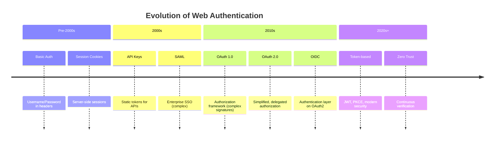
```mermaid
timeline
    title Evolution of Web Authentication
    section Pre-2000s
        Basic Auth : Username/Password in headers
        Session Cookies : Server-side sessions
    section 2000s
        API Keys : Static tokens for APIs
        SAML : Enterprise SSO (complex)
    section 2010s
        OAuth 1.0 : Authorization framework (complex signatures)
        OAuth 2.0 : Simplified, delegated authorization
        OIDC : Authentication layer on OAuth2
    section 2020s+
        Token-based : JWT, PKCE, modern security
        Zero Trust : Continuous verification
```

### OIDC Enhancements Over OAuth2

**Diagram Description:** This flowchart illustrates how OIDC builds upon OAuth2 by adding standardized user identity, JWT tokens, discovery endpoints, and user info capabilities. Each enhancement addresses specific limitations of pure OAuth2 authorization.

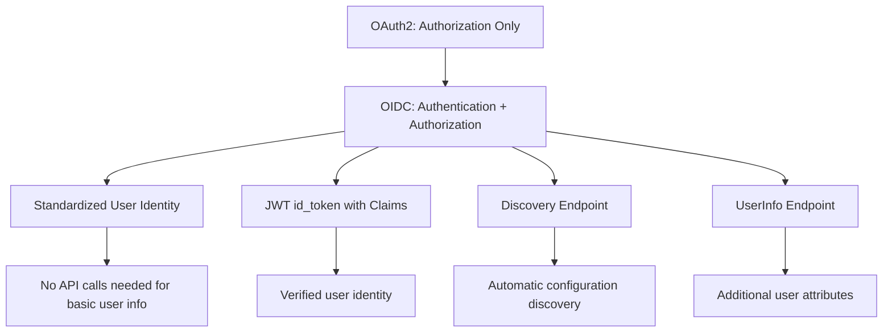
```mermaid
flowchart TD
    A[OAuth2: Authorization Only] --> B[OIDC: Authentication + Authorization]
    B --> C[Standardized User Identity]
    B --> D[JWT id_token with Claims]
    B --> E[Discovery Endpoint]
    B --> F[UserInfo Endpoint]
    
    C --> G[No API calls needed for basic user info]
    D --> H[Verified user identity]
    E --> I[Automatic configuration discovery]
    F --> J[Additional user attributes]
```

### OAuth2 in Production: GitHub API Integration

**Diagram Description:** This state diagram shows the complete OAuth2 flow for GitHub API integration in production. It illustrates how tokens are managed, refreshed, and how the application handles various states including token expiration and API failures. The flow demonstrates real-world production considerations like rate limiting and error handling.

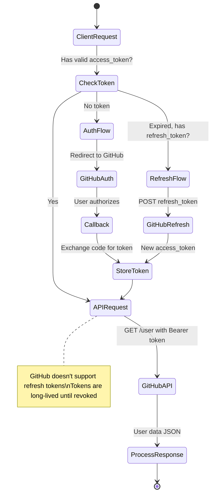
```mermaid
stateDiagram-v2
    [*] --> ClientRequest
    ClientRequest --> CheckToken: Has valid access_token?
    
    CheckToken --> APIRequest: Yes
    CheckToken --> RefreshFlow: Expired, has refresh_token?
    CheckToken --> AuthFlow: No token
    
    AuthFlow --> GitHubAuth: Redirect to GitHub
    GitHubAuth --> Callback: User authorizes
    Callback --> StoreToken: Exchange code for token
    
    RefreshFlow --> GitHubRefresh: POST refresh_token
    GitHubRefresh --> StoreToken: New access_token
    
    StoreToken --> APIRequest
    APIRequest --> GitHubAPI: GET /user with Bearer token
    GitHubAPI --> ProcessResponse: User data JSON
    ProcessResponse --> [*]
    
    note right of APIRequest : GitHub doesn't support refresh tokens\nTokens are long-lived until revoked
```

### OIDC in Production: Enterprise SSO

**Diagram Description:** This sequence diagram demonstrates a complete OIDC flow in an enterprise environment with session management. It shows how the service provider validates tokens, creates sessions, and handles subsequent requests. The diagram highlights the key difference: user identity is available immediately from the id_token without additional API calls.

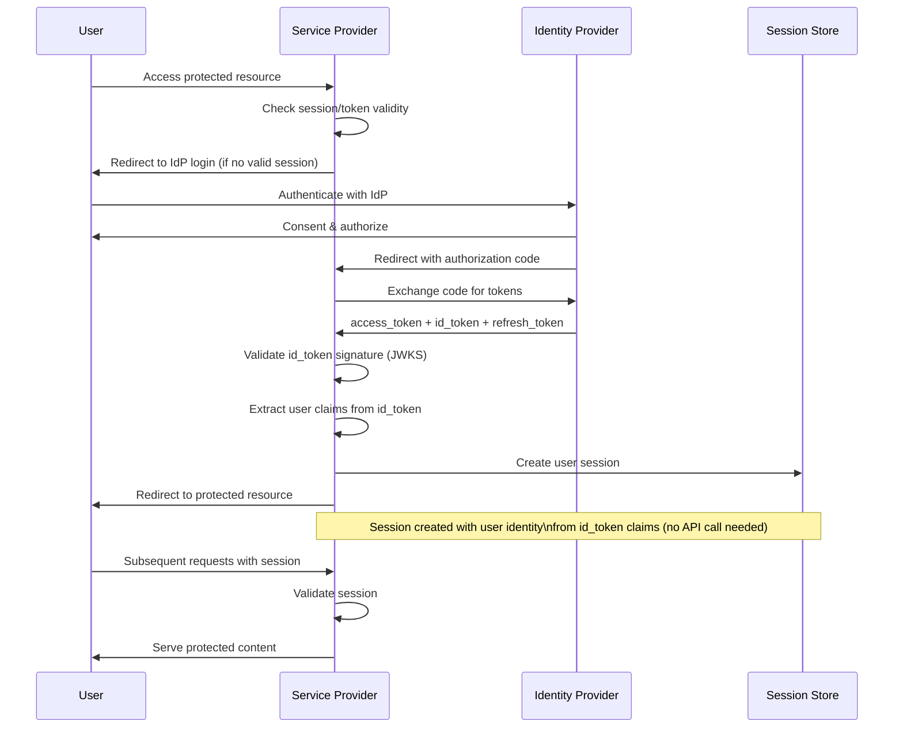
```mermaid
sequenceDiagram
    participant U as User
    participant SP as Service Provider
    participant IdP as Identity Provider
    participant DB as Session Store

    U->>SP: Access protected resource
    SP->>SP: Check session/token validity
    SP->>U: Redirect to IdP login (if no valid session)

    U->>IdP: Authenticate with IdP
    IdP->>U: Consent & authorize
    IdP->>SP: Redirect with authorization code

    SP->>IdP: Exchange code for tokens
    IdP->>SP: access_token + id_token + refresh_token

    SP->>SP: Validate id_token signature (JWKS)
    SP->>SP: Extract user claims from id_token
    SP->>DB: Create user session
    SP->>U: Redirect to protected resource

    Note over SP,DB: Session created with user identity\nfrom id_token claims (no API call needed)

    U->>SP: Subsequent requests with session
    SP->>SP: Validate session
    SP->>U: Serve protected content
```

### Real-time OAuth2 vs OIDC Decision Tree

**Diagram Description:** This decision flowchart helps developers choose between OAuth2 and OIDC based on their application requirements. It considers factors like application type, user interface, and scalability needs to guide the selection of the appropriate authentication protocol.

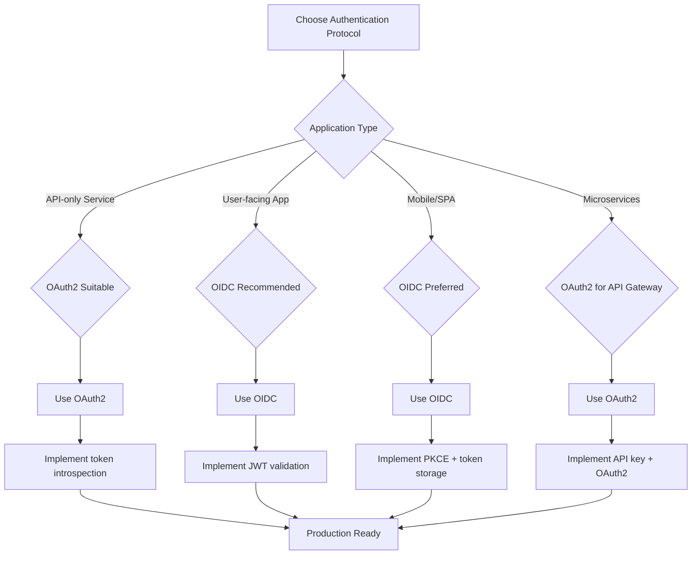
```mermaid
flowchart TD
    A[Choose Authentication Protocol] --> B{Application Type}
    
    B -->|API-only Service| C{OAuth2 Suitable}
    B -->|User-facing App| D{OIDC Recommended}
    B -->|Mobile/SPA| E{OIDC Preferred}
    B -->|Microservices| F{OAuth2 for API Gateway}
    
    C --> G[Use OAuth2]
    D --> H[Use OIDC]
    E --> I[Use OIDC]
    F --> J[Use OAuth2]
    
    G --> K[Implement token introspection]
    H --> L[Implement JWT validation]
    I --> M[Implement PKCE + token storage]
    J --> N[Implement API key + OAuth2]
    
    K --> O[Production Ready]
    L --> O
    M --> O
    N --> O
```

### Detailed OAuth2 Flow with Error Handling

**Diagram Description:** This comprehensive flowchart shows the complete OAuth2 authorization code flow including error scenarios and security measures. It demonstrates how the application handles various failure modes like invalid states, expired codes, and network failures, while maintaining security through PKCE and state validation.

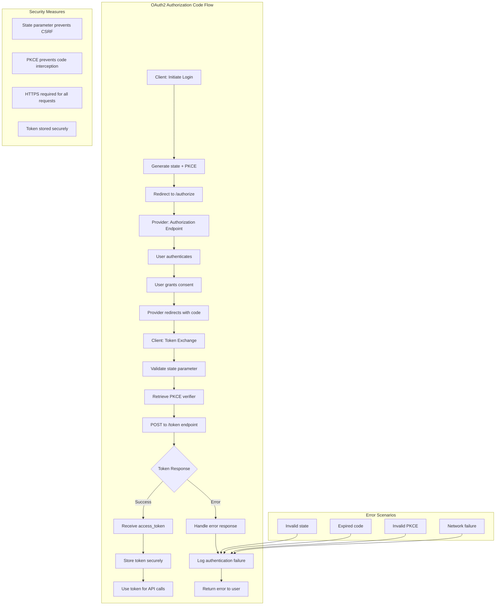
```mermaid
flowchart TD
    subgraph "OAuth2 Authorization Code Flow"
        A[Client: Initiate Login] --> B[Generate state + PKCE]
        B --> C[Redirect to /authorize]
        
        C --> D[Provider: Authorization Endpoint]
        D --> E[User authenticates]
        E --> F[User grants consent]
        F --> G[Provider redirects with code]
        
        G --> H[Client: Token Exchange]
        H --> I[Validate state parameter]
        I --> J[Retrieve PKCE verifier]
        J --> K[POST to /token endpoint]
        
        K --> L{Token Response}
        L -->|Success| M[Receive access_token]
        L -->|Error| N[Handle error response]
        
        M --> O[Store token securely]
        O --> P[Use token for API calls]
        
        N --> Q[Log authentication failure]
        Q --> R[Return error to user]
    end
    
    subgraph "Error Scenarios"
        S[Invalid state] --> Q
        T[Expired code] --> Q
        U[Invalid PKCE] --> Q
        V[Network failure] --> Q
    end
    
    subgraph "Security Measures"
        W[State parameter prevents CSRF]
        X[PKCE prevents code interception]
        Y[HTTPS required for all requests]
        Z[Token stored securely]
    end
```

### Detailed OIDC Flow with Token Validation

**Diagram Description:** This flowchart illustrates the complete OIDC flow with emphasis on token validation and JWT processing. It shows how id_tokens are validated, user claims extracted, and sessions created. The diagram highlights OIDC-specific features like JWKS endpoints and standardized user claims.

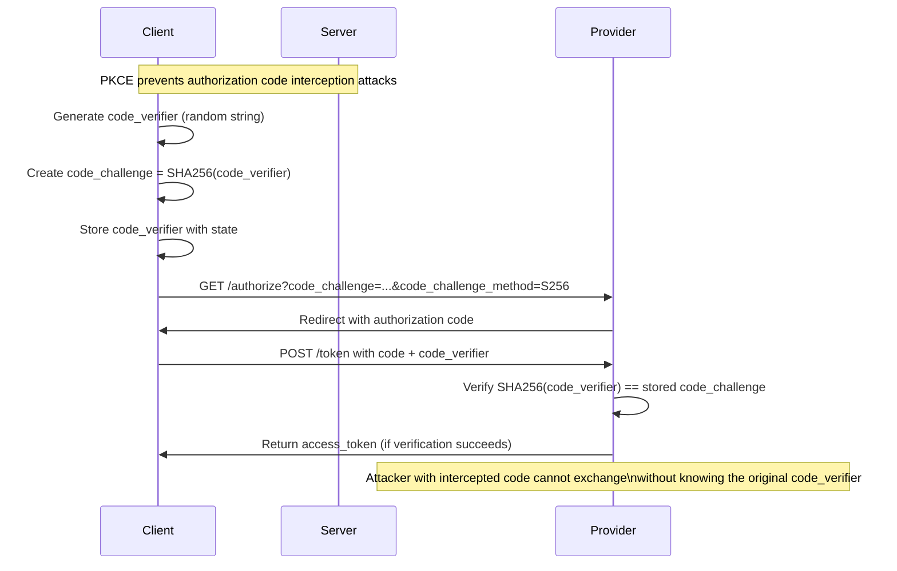
```mermaid
sequenceDiagram
    participant C as Client
    participant S as Server
    participant P as Provider

    Note over C,S: PKCE prevents authorization code interception attacks

    C->>C: Generate code_verifier (random string)
    C->>C: Create code_challenge = SHA256(code_verifier)
    C->>C: Store code_verifier with state

    C->>P: GET /authorize?code_challenge=...&code_challenge_method=S256
    P->>C: Redirect with authorization code

    C->>P: POST /token with code + code_verifier
    P->>P: Verify SHA256(code_verifier) == stored code_challenge
    P->>C: Return access_token (if verification succeeds)

    Note over P: Attacker with intercepted code cannot exchange\nwithout knowing the original code_verifier
```

### Session Management Flow

**Diagram Description:** This state diagram shows the complete lifecycle of user authentication sessions. It illustrates how sessions are created, validated, refreshed, and terminated. The diagram demonstrates the various states a user can be in and the transitions between them, including error handling and cleanup processes.

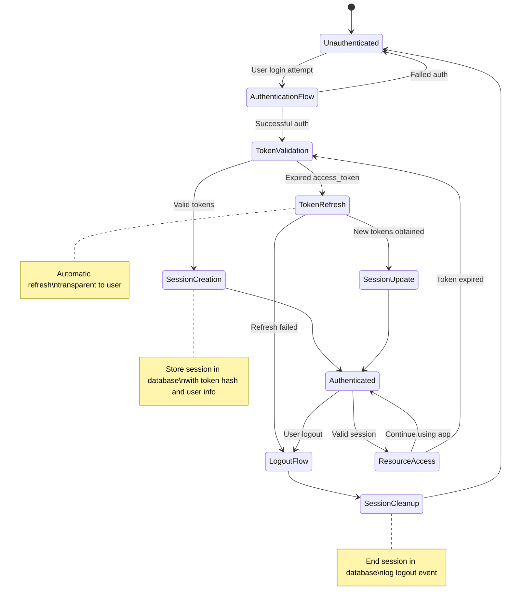
```mermaid
stateDiagram-v2
    [*] --> Unauthenticated
    Unauthenticated --> AuthenticationFlow : User login attempt
    
    AuthenticationFlow --> TokenValidation : Successful auth
    AuthenticationFlow --> Unauthenticated : Failed auth
    
    TokenValidation --> SessionCreation : Valid tokens
    TokenValidation --> TokenRefresh : Expired access_token
    
    TokenRefresh --> SessionUpdate : New tokens obtained
    TokenRefresh --> LogoutFlow : Refresh failed
    
    SessionCreation --> Authenticated
    SessionUpdate --> Authenticated
    
    Authenticated --> ResourceAccess : Valid session
    Authenticated --> LogoutFlow : User logout
    
    ResourceAccess --> Authenticated : Continue using app
    ResourceAccess --> TokenValidation : Token expired
    
    LogoutFlow --> SessionCleanup
    SessionCleanup --> Unauthenticated
    
    note right of SessionCreation : Store session in database\nwith token hash and user info
    note right of TokenRefresh : Automatic refresh\ntransparent to user
    note right of SessionCleanup : End session in database\nlog logout event
```

### Production Deployment Patterns

**Diagram Description:** This architecture diagram shows different deployment patterns for OAuth2/OIDC in production environments. It illustrates how web applications, mobile apps, and enterprise systems integrate with identity providers, highlighting the different architectural approaches for each use case.

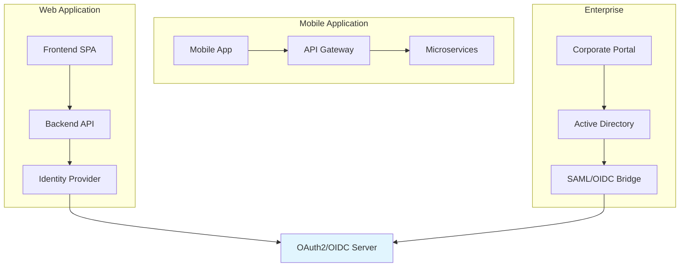
```mermaid
graph TB
    subgraph "Web Application"
        A[Frontend SPA]
        B[Backend API]
        C[Identity Provider]
    end
    
    subgraph "Mobile Application"
        D[Mobile App]
        E[API Gateway]
        F[Microservices]
    end
    
    subgraph "Enterprise"
        G[Corporate Portal]
        H[Active Directory]
        I[SAML/OIDC Bridge]
    end
    
    A --> B
    B --> C
    D --> E
    E --> F
    G --> H
    H --> I
    
    C --> J[OAuth2/OIDC Server]
    I --> J
    
    style J fill:#e1f5fe
```

---

## 🔄 Provider-Specific Implementation Flows

### GitHub OAuth2 Flow

**Diagram Description:** This sequence diagram shows the complete GitHub OAuth2 implementation flow. GitHub uses OAuth2 only (no OIDC), so it requires an additional API call to fetch user information. The flow demonstrates how the application handles GitHub's specific requirements and error cases.

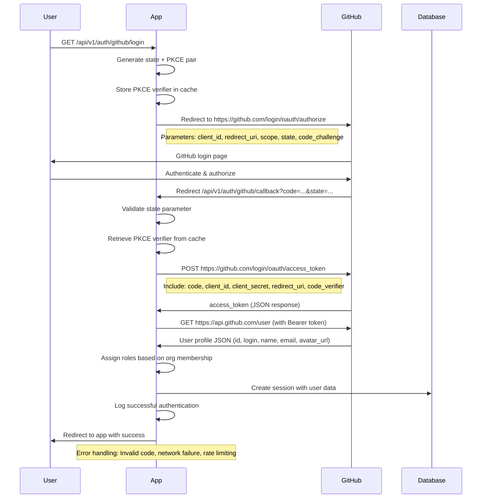
```mermaid
sequenceDiagram
    participant U as User
    participant A as App
    participant G as GitHub
    participant DB as Database

    U->>A: GET /api/v1/auth/github/login
    A->>A: Generate state + PKCE pair
    A->>A: Store PKCE verifier in cache
    A->>G: Redirect to https://github.com/login/oauth/authorize
    Note right of A: Parameters: client_id, redirect_uri, scope, state, code_challenge

    G->>U: GitHub login page
    U->>G: Authenticate & authorize
    G->>A: Redirect /api/v1/auth/github/callback?code=...&state=...

    A->>A: Validate state parameter
    A->>A: Retrieve PKCE verifier from cache
    A->>G: POST https://github.com/login/oauth/access_token
    Note right of A: Include: code, client_id, client_secret, redirect_uri, code_verifier

    G->>A: access_token (JSON response)
    A->>G: GET https://api.github.com/user (with Bearer token)
    G->>A: User profile JSON (id, login, name, email, avatar_url)

    A->>A: Assign roles based on org membership
    A->>DB: Create session with user data
    A->>A: Log successful authentication
    A->>U: Redirect to app with success

    Note over A: Error handling: Invalid code, network failure, rate limiting
```

### GitHub OIDC Flow (Conceptual)

**Diagram Description:** This conceptual sequence diagram shows how GitHub could implement OIDC if they supported it. Since GitHub currently only supports OAuth2, this demonstrates the theoretical flow with id_token for comparison purposes. In practice, GitHub would need to add OIDC support to their platform.

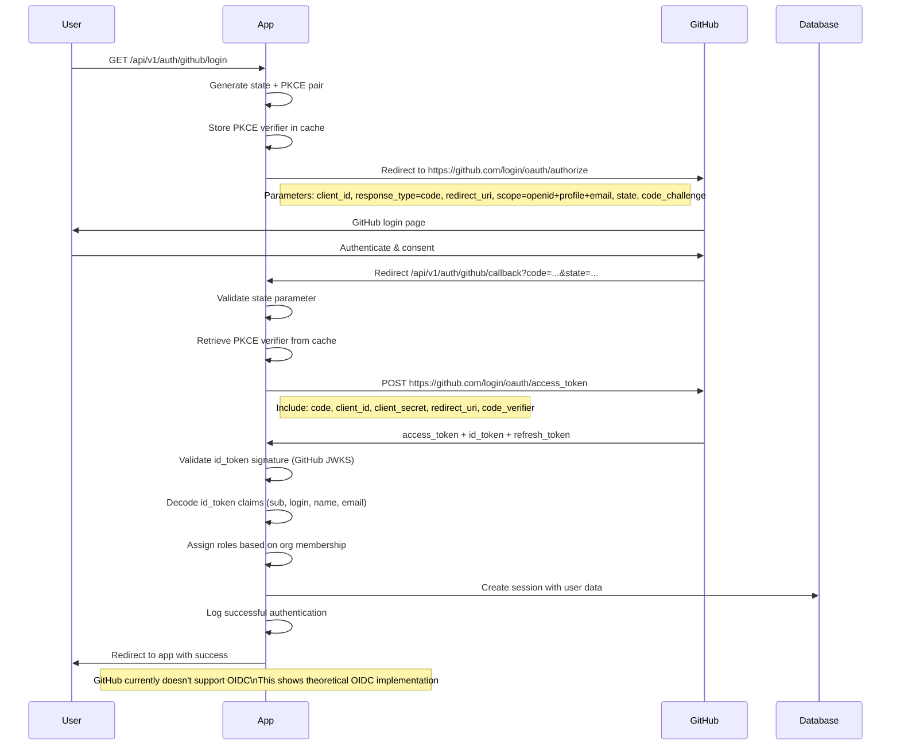
```mermaid
sequenceDiagram
    participant U as User
    participant A as App
    participant G as GitHub
    participant DB as Database

    U->>A: GET /api/v1/auth/github/login
    A->>A: Generate state + PKCE pair
    A->>A: Store PKCE verifier in cache
    A->>G: Redirect to https://github.com/login/oauth/authorize
    Note right of A: Parameters: client_id, response_type=code, redirect_uri, scope=openid+profile+email, state, code_challenge

    G->>U: GitHub login page
    U->>G: Authenticate & consent
    G->>A: Redirect /api/v1/auth/github/callback?code=...&state=...

    A->>A: Validate state parameter
    A->>A: Retrieve PKCE verifier from cache
    A->>G: POST https://github.com/login/oauth/access_token
    Note right of A: Include: code, client_id, client_secret, redirect_uri, code_verifier

    G->>A: access_token + id_token + refresh_token
    A->>A: Validate id_token signature (GitHub JWKS)
    A->>A: Decode id_token claims (sub, login, name, email)

    A->>A: Assign roles based on org membership
    A->>DB: Create session with user data
    A->>A: Log successful authentication
    A->>U: Redirect to app with success

    Note over A: GitHub currently doesn't support OIDC\nThis shows theoretical OIDC implementation
```

### Google OAuth2 Flow

**Diagram Description:** This sequence diagram shows the Google OAuth2 implementation flow. Google supports both OAuth2 and OIDC, but this diagram focuses on the OAuth2-only flow where user information requires a separate API call. The flow demonstrates Google's specific endpoints and token handling.

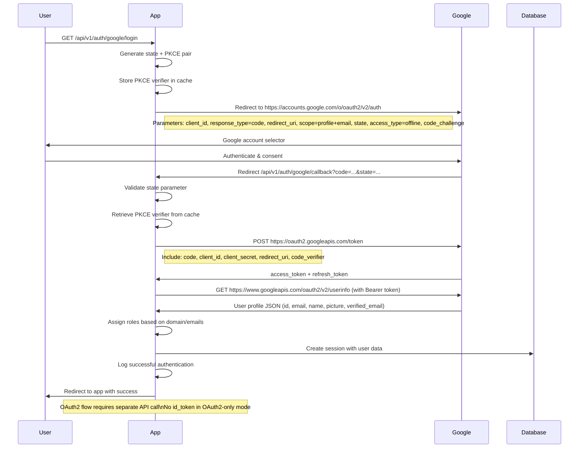
```mermaid
sequenceDiagram
    participant U as User
    participant A as App
    participant G as Google
    participant DB as Database

    U->>A: GET /api/v1/auth/google/login
    A->>A: Generate state + PKCE pair
    A->>A: Store PKCE verifier in cache
    A->>G: Redirect to https://accounts.google.com/o/oauth2/v2/auth
    Note right of A: Parameters: client_id, response_type=code, redirect_uri, scope=profile+email, state, access_type=offline, code_challenge

    G->>U: Google account selector
    U->>G: Authenticate & consent
    G->>A: Redirect /api/v1/auth/google/callback?code=...&state=...

    A->>A: Validate state parameter
    A->>A: Retrieve PKCE verifier from cache
    A->>G: POST https://oauth2.googleapis.com/token
    Note right of A: Include: code, client_id, client_secret, redirect_uri, code_verifier

    G->>A: access_token + refresh_token
    A->>G: GET https://www.googleapis.com/oauth2/v2/userinfo (with Bearer token)
    G->>A: User profile JSON (id, email, name, picture, verified_email)

    A->>A: Assign roles based on domain/emails
    A->>DB: Create session with user data
    A->>A: Log successful authentication
    A->>U: Redirect to app with success

    Note over A: OAuth2 flow requires separate API call\nNo id_token in OAuth2-only mode
```

### Google OIDC Flow

**Diagram Description:** This sequence diagram shows the Google OIDC implementation flow. Google provides comprehensive OIDC support with id_token containing verified user claims. The diagram highlights Google's specific endpoints and offline access for refresh tokens.

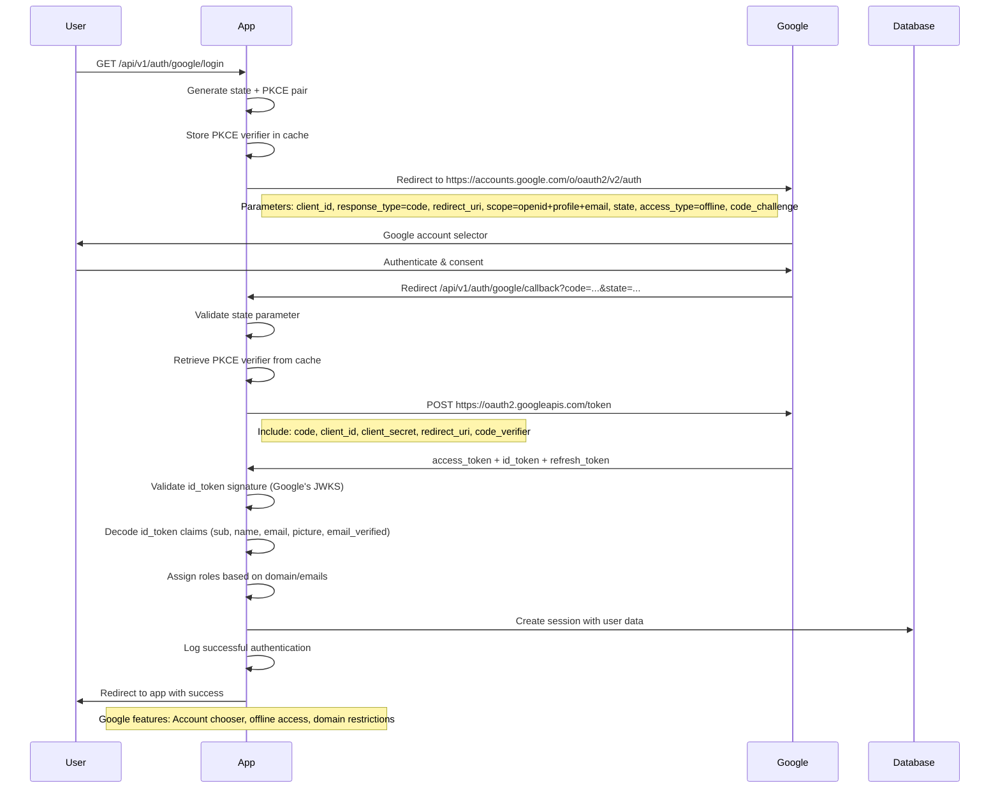
```mermaid
sequenceDiagram
    participant U as User
    participant A as App
    participant G as Google
    participant DB as Database

    U->>A: GET /api/v1/auth/google/login
    A->>A: Generate state + PKCE pair
    A->>A: Store PKCE verifier in cache
    A->>G: Redirect to https://accounts.google.com/o/oauth2/v2/auth
    Note right of A: Parameters: client_id, response_type=code, redirect_uri, scope=openid+profile+email, state, access_type=offline, code_challenge

    G->>U: Google account selector
    U->>G: Authenticate & consent
    G->>A: Redirect /api/v1/auth/google/callback?code=...&state=...

    A->>A: Validate state parameter
    A->>A: Retrieve PKCE verifier from cache
    A->>G: POST https://oauth2.googleapis.com/token
    Note right of A: Include: code, client_id, client_secret, redirect_uri, code_verifier

    G->>A: access_token + id_token + refresh_token
    A->>A: Validate id_token signature (Google's JWKS)
    A->>A: Decode id_token claims (sub, name, email, picture, email_verified)

    A->>A: Assign roles based on domain/emails
    A->>DB: Create session with user data
    A->>A: Log successful authentication
    A->>U: Redirect to app with success

    Note over A: Google features: Account chooser, offline access, domain restrictions
```

### Azure OAuth2 Flow

**Diagram Description:** This sequence diagram shows the Azure AD OAuth2 implementation flow. Azure supports both OAuth2 and OIDC, but this diagram focuses on the OAuth2-only flow where user information requires a separate API call. The flow demonstrates Azure-specific tenant endpoints and token handling.

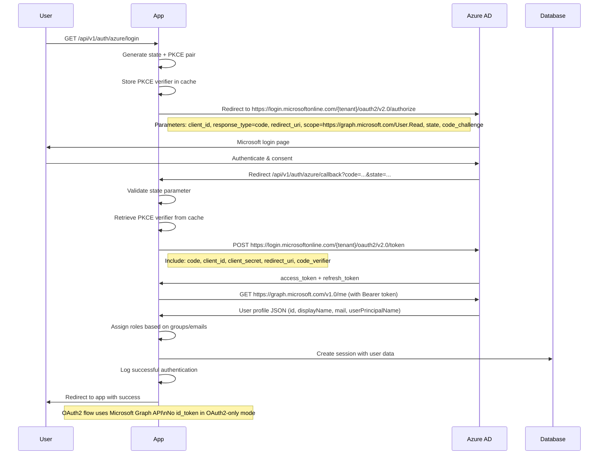
```mermaid
sequenceDiagram
    participant U as User
    participant A as App
    participant Az as Azure AD
    participant DB as Database

    U->>A: GET /api/v1/auth/azure/login
    A->>A: Generate state + PKCE pair
    A->>A: Store PKCE verifier in cache
    A->>Az: Redirect to https://login.microsoftonline.com/{tenant}/oauth2/v2.0/authorize
    Note right of A: Parameters: client_id, response_type=code, redirect_uri, scope=https://graph.microsoft.com/User.Read, state, code_challenge

    Az->>U: Microsoft login page
    U->>Az: Authenticate & consent
    Az->>A: Redirect /api/v1/auth/azure/callback?code=...&state=...

    A->>A: Validate state parameter
    A->>A: Retrieve PKCE verifier from cache
    A->>Az: POST https://login.microsoftonline.com/{tenant}/oauth2/v2.0/token
    Note right of A: Include: code, client_id, client_secret, redirect_uri, code_verifier

    Az->>A: access_token + refresh_token
    A->>Az: GET https://graph.microsoft.com/v1.0/me (with Bearer token)
    Az->>A: User profile JSON (id, displayName, mail, userPrincipalName)

    A->>A: Assign roles based on groups/emails
    A->>DB: Create session with user data
    A->>A: Log successful authentication
    A->>U: Redirect to app with success

    Note over A: OAuth2 flow uses Microsoft Graph API\nNo id_token in OAuth2-only mode
```

### Azure AD OIDC Flow

**Diagram Description:** This sequence diagram illustrates the Azure AD OIDC implementation. Azure supports full OIDC, providing id_token with verified claims. The flow shows Azure-specific features like tenant-specific endpoints and group-based role assignment.

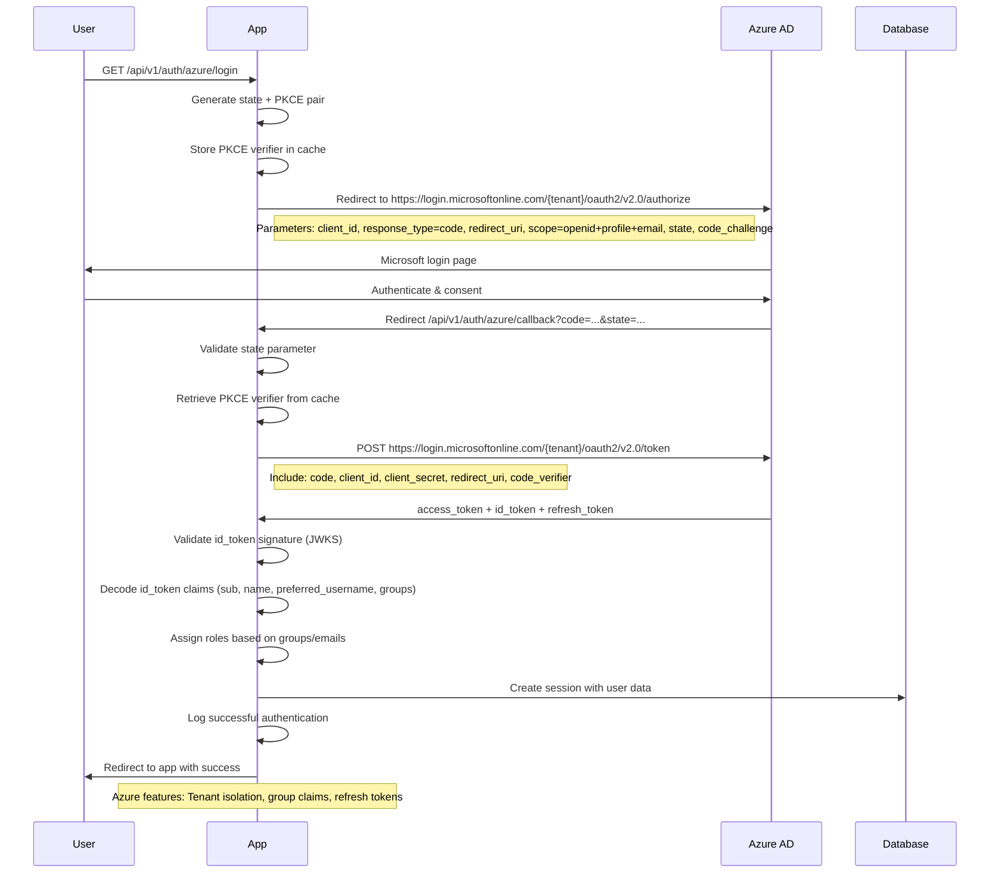
```mermaid
sequenceDiagram
    participant U as User
    participant A as App
    participant Az as Azure AD
    participant DB as Database

    U->>A: GET /api/v1/auth/azure/login
    A->>A: Generate state + PKCE pair
    A->>A: Store PKCE verifier in cache
    A->>Az: Redirect to https://login.microsoftonline.com/{tenant}/oauth2/v2.0/authorize
    Note right of A: Parameters: client_id, response_type=code, redirect_uri, scope=openid+profile+email, state, code_challenge

    Az->>U: Microsoft login page
    U->>Az: Authenticate & consent
    Az->>A: Redirect /api/v1/auth/azure/callback?code=...&state=...

    A->>A: Validate state parameter
    A->>A: Retrieve PKCE verifier from cache
    A->>Az: POST https://login.microsoftonline.com/{tenant}/oauth2/v2.0/token
    Note right of A: Include: code, client_id, client_secret, redirect_uri, code_verifier

    Az->>A: access_token + id_token + refresh_token
    A->>A: Validate id_token signature (JWKS)
    A->>A: Decode id_token claims (sub, name, preferred_username, groups)

    A->>A: Assign roles based on groups/emails
    A->>DB: Create session with user data
    A->>A: Log successful authentication
    A->>U: Redirect to app with success

    Note over A: Azure features: Tenant isolation, group claims, refresh tokens
```

### Auth0 OAuth2 Flow

**Diagram Description:** This sequence diagram shows the Auth0 OAuth2 implementation flow. Auth0 supports both OAuth2 and OIDC, but this diagram focuses on the OAuth2-only flow where user information requires a separate API call. The flow demonstrates Auth0-specific endpoints and token handling.

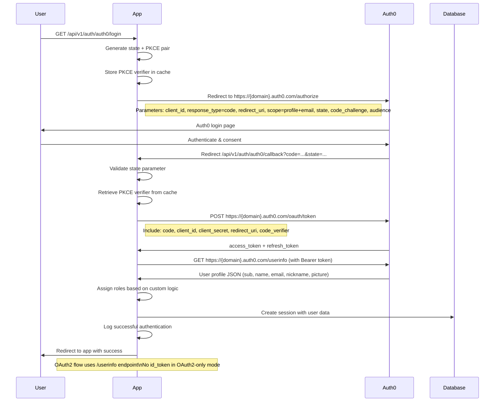
```mermaid
sequenceDiagram
    participant U as User
    participant A as App
    participant Au as Auth0
    participant DB as Database

    U->>A: GET /api/v1/auth/auth0/login
    A->>A: Generate state + PKCE pair
    A->>A: Store PKCE verifier in cache
    A->>Au: Redirect to https://{domain}.auth0.com/authorize
    Note right of A: Parameters: client_id, response_type=code, redirect_uri, scope=profile+email, state, code_challenge, audience

    Au->>U: Auth0 login page
    U->>Au: Authenticate & consent
    Au->>A: Redirect /api/v1/auth/auth0/callback?code=...&state=...

    A->>A: Validate state parameter
    A->>A: Retrieve PKCE verifier from cache
    A->>Au: POST https://{domain}.auth0.com/oauth/token
    Note right of A: Include: code, client_id, client_secret, redirect_uri, code_verifier

    Au->>A: access_token + refresh_token
    A->>Au: GET https://{domain}.auth0.com/userinfo (with Bearer token)
    Au->>A: User profile JSON (sub, name, email, nickname, picture)

    A->>A: Assign roles based on custom logic
    A->>DB: Create session with user data
    A->>A: Log successful authentication
    A->>U: Redirect to app with success

    Note over A: OAuth2 flow uses /userinfo endpoint\nNo id_token in OAuth2-only mode
```

### Auth0 OIDC Flow

**Diagram Description:** This sequence diagram demonstrates the Auth0 OIDC implementation. Auth0 acts as a flexible identity platform supporting full OIDC with customizable user stores. The flow shows Auth0-specific features like audience parameters and custom user claims.

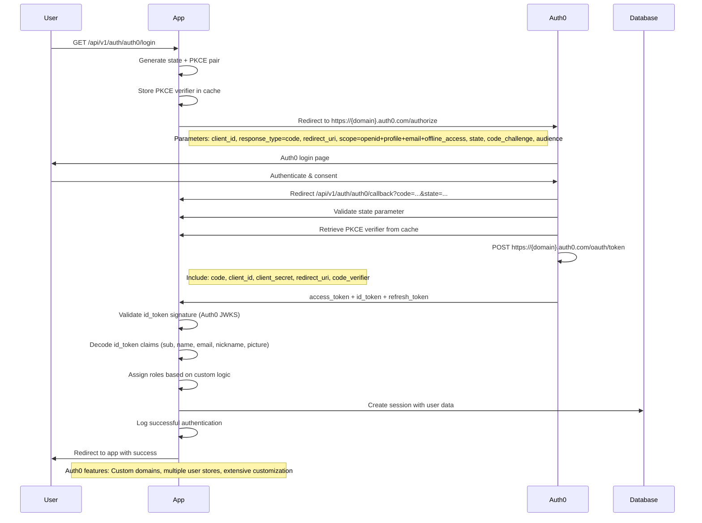
```mermaid
sequenceDiagram
    participant U as User
    participant A as App
    participant Au as Auth0
    participant DB as Database

    U->>A: GET /api/v1/auth/auth0/login
    A->>A: Generate state + PKCE pair
    A->>A: Store PKCE verifier in cache
    A->>Au: Redirect to https://{domain}.auth0.com/authorize
    Note right of A: Parameters: client_id, response_type=code, redirect_uri, scope=openid+profile+email+offline_access, state, code_challenge, audience

    Au->>U: Auth0 login page
    U->>Au: Authenticate & consent
    Au->>A: Redirect /api/v1/auth/auth0/callback?code=...&state=...

    Au->>A: Validate state parameter
    Au->>A: Retrieve PKCE verifier from cache
    Au->>Au: POST https://{domain}.auth0.com/oauth/token
    Note right of A: Include: code, client_id, client_secret, redirect_uri, code_verifier

    Au->>A: access_token + id_token + refresh_token
    A->>A: Validate id_token signature (Auth0 JWKS)
    A->>A: Decode id_token claims (sub, name, email, nickname, picture)

    A->>A: Assign roles based on custom logic
    A->>DB: Create session with user data
    A->>A: Log successful authentication
    A->>U: Redirect to app with success

    Note over A: Auth0 features: Custom domains, multiple user stores, extensive customization
```
