# OAuth2 / OIDC Implementation Demo

> A comprehensive FastAPI application demonstrating OAuth2 and OpenID Connect (OIDC) authentication flows across multiple identity providers.

---

## Table of Contents

1. [Introduction](#-introduction)
2. [OAuth2 vs OIDC - Understanding the Difference](#-oauth2-vs-oidc---understanding-the-difference)
3. [Architecture Overview](#-architecture-overview)
4. [Provider Flow Diagrams](#-provider-flow-diagrams)
5. [Core Auth Module - The Heart of the System](#-core-auth-module---the-heart-of-the-system)
6. [Environment Variables Mapping](#-environment-variables-mapping)
7. [Provider Comparison Table](#-provider-comparison-table)
8. [API Endpoints](#-api-endpoints)
9. [Demo Endpoints](#-demo-endpoints)
10. [Setup Guide](#-setup-guide)
11. [Provider Configuration Guides](#-provider-configuration-guides)

---

## 🎯 Introduction

This project demonstrates the practical differences between **OAuth2** and **OpenID Connect (OIDC)** protocols using three major identity providers:

| Provider | Protocol | Use Case |
|----------|----------|----------|
| **GitHub** | OAuth2 Only | Developer platforms, Open source projects |
| **Azure AD** | Full OIDC | Enterprise applications, Microsoft ecosystem |
| **Google** | Full OIDC | Consumer apps, Google Workspace integration |

### What You'll Learn

- How OAuth2 differs from OIDC in practice
- Token types: `access_token`, `id_token`, `refresh_token`
- JWT validation using JWKS endpoints
- Role-based access control across providers
- Session management and authentication logging

---

## 🔐 OAuth2 vs OIDC - Understanding the Difference

### OAuth2 - Authorization Protocol

OAuth2 is an **authorization** framework that allows applications to obtain limited access to user accounts.

**Key Characteristics:**
- Provides `access_token` for API access
- Does NOT define identity/authentication
- No standard way to get user info
- Token format is not specified (can be opaque)

### OIDC - Authentication Protocol

OpenID Connect is an **authentication** layer built on top of OAuth2.

**Key Characteristics:**
- Adds `id_token` (JWT with user claims)
- Standardized user info endpoint
- JWKS endpoint for token validation
- Defines standard scopes: `openid`, `profile`, `email`

### Visual Comparison

```
┌─────────────────────────────────────────────────────────────────┐
│                         OAuth2 Only                              │
│  ┌──────────┐    ┌──────────────┐    ┌──────────────────────┐  │
│  │  User    │───▶│ Auth Server  │───▶│ access_token (opaque)│  │
│  └──────────┘    └──────────────┘    └──────────────────────┘  │
│                                              │                   │
│                                              ▼                   │
│                                      ┌──────────────┐           │
│                                      │  API Call    │           │
│                                      │  for user    │           │
│                                      │  info        │           │
│                                      └──────────────┘           │
└─────────────────────────────────────────────────────────────────┘

┌─────────────────────────────────────────────────────────────────┐
│                      OpenID Connect (OIDC)                       │
│  ┌──────────┐    ┌──────────────┐    ┌──────────────────────┐  │
│  │  User    │───▶│ Auth Server  │───▶│ access_token (JWT)   │  │
│  └──────────┘    └──────────────┘    │ id_token (JWT)       │  │
│                                       │ refresh_token        │  │
│                                       └──────────────────────┘  │
│                                              │                   │
│                                              ▼                   │
│                                      ┌──────────────┐           │
│                                      │ Decode JWT   │           │
│                                      │ = User info  │           │
│                                      │ (No API call)│           │
│                                      └──────────────┘           │
└─────────────────────────────────────────────────────────────────┘
```

---

## 🏗 Architecture Overview

```
src/
├── core/                           # Reusable authentication core
│   ├── auth/
│   │   ├── base.py                 # Abstract provider interface
│   │   ├── factory.py              # Provider registry & factory
│   │   ├── oidc_client.py          # Generic OIDC client
│   │   └── oidc_token_validator.py # JWT validation with JWKS
│   ├── configuration/
│   │   ├── configurations.py       # Provider configurations
│   │   └── logger_dependency.py    # Logging dependency
│   ├── exceptions/
│   │   └── exceptions.py           # Custom exceptions
│   ├── models/
│   │   └── database_models.py      # SQLModel session tracking
│   ├── services/
│   │   └── session_service.py      # Session management
│   └── settings/
│       └── app.py                  # Environment settings
│
└── fastapi/                        # FastAPI application
    ├── routers/auth/
    │   ├── demo.py                 # OAuth2 vs OIDC demo endpoints
    │   ├── generic.py              # Provider-agnostic endpoints
    │   ├── github.py               # GitHub OAuth2 endpoints
    │   ├── azure.py                # Azure AD OIDC endpoints
    │   └── google.py               # Google OIDC endpoints
    ├── services/auth/
    │   ├── github_service.py       # GitHub implementation
    │   ├── azure_service.py        # Azure implementation
    │   ├── google_service.py       # Google implementation
    │   └── role_service.py         # Role assignment
    ├── models/auth/
    │   └── common_models.py        # Unified user models
    ├── api.py                      # Router aggregation
    └── main.py                     # Application entry point
```

---

## 🔐 PKCE (Proof Key for Code Exchange)

### What is PKCE?

PKCE (pronounced "pixy") is a security extension for OAuth2 that protects against **authorization code interception attacks**. It's especially critical for:

- **Public clients** (SPAs, mobile apps, CLI tools)
- **Swagger UI** authorization
- **Any client that can't securely store secrets**

### Why PKCE is Needed

#### The Problem: Authorization Code Interception

In the standard OAuth2 Authorization Code flow, the authorization code is sent back to the client via a redirect URL. This creates a vulnerability:

```mermaid
sequenceDiagram
    autonumber
    participant User as 👤 User
    participant App as 📱 Legitimate App
    participant Attacker as 🔴 Malicious App
    participant Provider as 🔐 OAuth Provider

    Note over User,Provider: WITHOUT PKCE - Vulnerable!
    
    User->>App: Click "Login"
    App->>Provider: Redirect to /authorize
    Provider->>User: Show login page
    User->>Provider: Enter credentials
    Provider->>App: Redirect with ?code=abc123
    
    rect rgb(255, 200, 200)
        Note over Attacker: Attack Vector!
        Attacker->>Attacker: Intercept code via:<br/>• Custom URL scheme hijacking<br/>• Malicious browser extension<br/>• Network interception<br/>• Shared redirect URI
        Attacker->>Provider: POST /token with code=abc123
        Provider->>Attacker: ✅ access_token, refresh_token
        Note over Attacker: 🔴 Attacker now has<br/>full access to user's account!
    end
```



#### How PKCE Solves This

PKCE adds a **cryptographic proof** that only the original client can exchange the code:


#### Attack Vectors PKCE Prevents

| Attack Type | Description | PKCE Protection |
|-------------|-------------|-----------------|
| **URL Scheme Hijacking** | Malicious app registers same custom URL scheme | ✅ Attacker can't provide code_verifier |
| **Browser Extension Attack** | Extension reads redirect URL | ✅ Code useless without verifier |
| **Network Interception** | MITM captures authorization code | ✅ Code can't be exchanged |
| **Shared Redirect URI** | Multiple apps use same redirect | ✅ Only original app has verifier |

### When PKCE Can Be Ignored

While PKCE is a best practice, there are scenarios where it's **optional** or can be safely skipped:

```mermaid
flowchart TD
    Q1{What type of client?}
    
    Q1 -->|Public Client<br/>SPA, Mobile, CLI| P1["🔴 PKCE REQUIRED"]
    Q1 -->|Confidential Client<br/>Server-side app| Q2{Can you securely<br/>store client_secret?}
    
    Q2 -->|Yes| Q3{Is client_secret<br/>transmitted securely?}
    Q2 -->|No| P2["🔴 PKCE REQUIRED"]
    
    Q3 -->|Yes, via HTTPS| Q4{Is your backend<br/>the only token exchanger?}
    Q3 -->|No| P3["🔴 PKCE REQUIRED"]
    
    Q4 -->|Yes| P4["🟡 PKCE OPTIONAL<br/>(but still recommended)"]
    Q4 -->|No| P5["🔴 PKCE REQUIRED"]
    
    style P1 fill:#ffcccc
    style P2 fill:#ffcccc
    style P3 fill:#ffcccc
    style P5 fill:#ffcccc
    style P4 fill:#ffffcc
```



#### Scenarios Where PKCE is Optional

| Scenario | Why It's Safe | Recommendation |
|----------|---------------|----------------|
| **Server-side web app** | Client secret stored securely on server, never exposed | ✅ Safe, but PKCE still recommended |
| **Backend-to-backend** | No user redirect, uses client_credentials grant | ✅ PKCE not applicable |
| **Trusted internal network** | Isolated network with no external access | ⚠️ Still recommend PKCE |

#### Scenarios Where PKCE is REQUIRED

| Scenario | Why It's Required | Risk Without PKCE |
|----------|-------------------|-------------------|
| **Single Page App (SPA)** | Can't securely store client_secret in browser | 🔴 Token theft |
| **Mobile App** | URL schemes can be hijacked | 🔴 Account takeover |
| **Desktop App** | No secure secret storage | 🔴 Credential theft |
| **CLI Tool** | Redirect to localhost can be intercepted | 🔴 Token interception |
| **Swagger UI** | Browser-based, public client | 🔴 Testing credentials exposed |

### This Project's Approach

```mermaid
flowchart LR
    subgraph Config["Configuration"]
        C1["use_pkce = True<br/>(default)"]
    end
    
    subgraph Providers["All Providers"]
        P1["GitHub"]
        P2["Azure AD"]
        P3["Google"]
    end
    
    subgraph Security["Security Level"]
        S1["✅ PKCE Enabled"]
        S2["✅ code_verifier stored"]
        S3["✅ code_challenge sent"]
    end
    
    Config --> Providers
    Providers --> Security
    
    style S1 fill:#ccffcc
    style S2 fill:#ccffcc
    style S3 fill:#ccffcc
```



**This project enables PKCE by default for all providers** because:

1. ✅ **Defense in depth** - Extra security layer even for confidential clients
2. ✅ **Future-proof** - If client becomes public, already protected
3. ✅ **No downside** - Minimal performance impact
4. ✅ **Provider support** - GitHub, Azure, Google all support PKCE

#### Disabling PKCE (Not Recommended)

If you need to disable PKCE for legacy provider compatibility:

```python
# In GenericOIDCClient initialization
client = GenericOIDCClient(
    client_id="...",
    client_secret="...",
    use_pkce=False,  # ⚠️ Not recommended
    ...
)
```

### Summary: PKCE Decision Matrix

| Question | Answer | PKCE? |
|----------|--------|-------|
| Is client_secret exposed to users? | Yes | 🔴 **REQUIRED** |
| Is app running in browser? | Yes | 🔴 **REQUIRED** |
| Is app a mobile/desktop app? | Yes | 🔴 **REQUIRED** |
| Is app server-side with secure secret? | Yes | 🟡 **Optional but recommended** |
| Is it machine-to-machine (no user)? | Yes | ⚪ **Not applicable** |

### Why PKCE is Needed (Visual Summary)

```mermaid
flowchart TB
    subgraph Attack["⚠️ Without PKCE - Vulnerable to Attack"]
        A1[User clicks Login] --> A2[App generates state]
        A2 --> A3[Redirect to Provider]
        A3 --> A4[User authenticates]
        A4 --> A5[Provider returns code]
        A5 --> A6["🔴 Attacker intercepts code!"]
        A6 --> A7["🔴 Attacker exchanges code"]
        A7 --> A8["🔴 Attacker gets tokens!"]
    end
    
    subgraph Safe["✅ With PKCE - Protected"]
        B1[User clicks Login] --> B2[App generates code_verifier]
        B2 --> B3[App creates code_challenge = SHA256(verifier)]
        B3 --> B4[Redirect with code_challenge]
        B4 --> B5[User authenticates]
        B5 --> B6[Provider returns code]
        B6 --> B7["🔴 Attacker intercepts code"]
        B7 --> B8["❌ Attacker can't exchange<br/>(doesn't have code_verifier)"]
        B6 --> B9["✅ App exchanges code + verifier"]
        B9 --> B10["✅ App gets tokens"]
    end
    
    style A6 fill:#ffcccc
    style A7 fill:#ffcccc
    style A8 fill:#ffcccc
    style B8 fill:#ffcccc
    style B9 fill:#ccffcc
    style B10 fill:#ccffcc
```

### PKCE Flow Explained

```mermaid
sequenceDiagram
    autonumber
    participant App as ⚡ FastAPI App
    participant Browser as 🌐 Browser
    participant Provider as 🔐 OAuth Provider

    rect rgb(240, 255, 240)
        Note over App,Provider: Step 1: Generate PKCE Pair
        App->>App: Generate random code_verifier (43-128 chars)
        App->>App: code_challenge = BASE64URL(SHA256(code_verifier))
        App->>App: Store code_verifier (keyed by state)
    end

    rect rgb(240, 248, 255)
        Note over App,Provider: Step 2: Authorization Request (with PKCE)
        App->>Browser: Redirect to Provider
        Browser->>Provider: GET /authorize?<br/>code_challenge=xxx&<br/>code_challenge_method=S256&<br/>state=yyy
        Provider->>Provider: Store code_challenge with auth session
    end

    rect rgb(255, 248, 240)
        Note over App,Provider: Step 3: User Authentication
        Provider->>Browser: Show login page
        Browser->>Provider: User authenticates
        Provider->>Browser: Redirect with ?code=xxx&state=yyy
        Browser->>App: GET /callback?code=xxx&state=yyy
    end

    rect rgb(255, 240, 255)
        Note over App,Provider: Step 4: Token Exchange (with code_verifier)
        App->>App: Retrieve code_verifier using state
        App->>Provider: POST /token<br/>code=xxx&<br/>code_verifier=original_verifier
        Provider->>Provider: Verify: SHA256(code_verifier) == stored code_challenge
        Provider->>App: ✅ access_token, id_token, refresh_token
    end
```



### PKCE Parameters

| Parameter | Description | Example |
|-----------|-------------|---------|
| `code_verifier` | Random string (43-128 chars, URL-safe) | `dBjftJeZ4CVP-mB92K27uhbUJU1p1r_wW1gFWFOEjXk` |
| `code_challenge` | BASE64URL(SHA256(code_verifier)) | `E9Melhoa2OwvFrEMTJguCHaoeK1t8URWbuGJSstw-cM` |
| `code_challenge_method` | Always `S256` (SHA-256) | `S256` |

### With vs Without PKCE Comparison

```mermaid
flowchart LR
    subgraph Without["❌ Without PKCE"]
        W1["Authorization Request"] --> W2["code_challenge: ❌"]
        W3["Token Request"] --> W4["code_verifier: ❌"]
        W5["Security"] --> W6["🔴 Vulnerable"]
    end
    
    subgraph With["✅ With PKCE"]
        P1["Authorization Request"] --> P2["code_challenge: ✅"]
        P3["Token Request"] --> P4["code_verifier: ✅"]
        P5["Security"] --> P6["🟢 Protected"]
    end
    
    style W6 fill:#ffcccc
    style P6 fill:#ccffcc
```



### PKCE Implementation in This Project

This project implements PKCE for all providers:

```python
# 1. Generate PKCE pair
code_verifier = secrets.token_urlsafe(64)  # Random 64-byte string
code_challenge = base64url(sha256(code_verifier))

# 2. Authorization URL includes code_challenge
params = {
    "client_id": "...",
    "code_challenge": code_challenge,
    "code_challenge_method": "S256",
    "state": state,
    ...
}

# 3. Token exchange includes code_verifier
data = {
    "code": authorization_code,
    "code_verifier": code_verifier,  # Original verifier
    ...
}
```

### Provider PKCE Support

| Provider | PKCE Support | Notes |
|----------|:------------:|-------|
| **GitHub** | ✅ Optional | Works without, recommended with |
| **Azure AD** | ✅ Required for SPAs | Enforced for public clients |
| **Google** | ✅ Recommended | Required for mobile/desktop apps |

---

## 📊 Provider Flow Diagrams

### Overview: OAuth2 vs OIDC Token Flow

```mermaid
flowchart TB
    subgraph OAuth2["OAuth2 Only (GitHub)"]
        O1[User Login] --> O2[Authorization Code]
        O2 --> O3[Exchange for Tokens]
        O3 --> O4["access_token ✅<br/>(opaque string)"]
        O3 --> O5["id_token ❌<br/>(not provided)"]
        O3 --> O6["refresh_token ❌<br/>(not provided)"]
        O4 --> O7[API Call Required]
        O7 --> O8[User Info]
    end
    
    subgraph OIDC["OIDC (Azure/Google)"]
        I1[User Login] --> I2[Authorization Code]
        I2 --> I3[Exchange for Tokens]
        I3 --> I4["access_token ✅<br/>(JWT or opaque)"]
        I3 --> I5["id_token ✅<br/>(JWT with claims)"]
        I3 --> I6["refresh_token ✅<br/>(for token refresh)"]
        I5 --> I7[Decode JWT]
        I7 --> I8[User Info from Claims]
    end
    
    style O5 fill:#ffcccc
    style O6 fill:#ffcccc
    style I5 fill:#ccffcc
    style I6 fill:#ccffcc
```



---

### GitHub OAuth2 Flow (Detailed) - With PKCE

```mermaid
sequenceDiagram
    autonumber
    participant User as 👤 User
    participant Browser as 🌐 Browser
    participant App as ⚡ FastAPI App
    participant GH as 🐙 GitHub
    participant DB as 🗄️ Database

    rect rgb(240, 255, 240)
        Note over App: PKCE Setup
        App->>App: Generate code_verifier
        App->>App: code_challenge = SHA256(verifier)
        App->>App: Store verifier with state
    end

    rect rgb(240, 248, 255)
        Note over User,GH: Step 1: Initiate Login
        User->>Browser: Click "Login with GitHub"
        Browser->>App: GET /auth/github/login
        App->>App: Generate state token (CSRF protection)
        App->>Browser: 302 Redirect to GitHub
    end
    
    rect rgb(255, 248, 240)
        Note over User,GH: Step 2: User Authentication
        Browser->>GH: GET /login/oauth/authorize
        Note right of GH: client_id, redirect_uri,<br/>code_challenge, code_challenge_method=S256,<br/>scope=read:user user:email,<br/>state=xxx
        GH->>User: Show login page
        User->>GH: Enter credentials
        GH->>User: Show consent screen
        User->>GH: Approve access
    end
    
    rect rgb(240, 255, 240)
        Note over User,GH: Step 3: Authorization Code
        GH->>Browser: 302 Redirect with ?code=xxx&state=xxx
        Browser->>App: GET /auth/github/callback?code=xxx&state=xxx
        App->>App: Validate state parameter
    end
    
    rect rgb(255, 240, 255)
        Note over User,GH: Step 4: Token Exchange
        App->>GH: POST /login/oauth/access_token
        Note right of GH: code, client_id,<br/>client_secret
        GH->>App: access_token (gho_xxx...)
        Note over App: ⚠️ No id_token!<br/>⚠️ No refresh_token!<br/>⚠️ Token never expires!
    end
    
    rect rgb(240, 240, 255)
        Note over User,GH: Step 5: Get User Info (API Call Required!)
        App->>GH: GET /user (Bearer gho_xxx)
        GH->>App: User profile JSON
        App->>GH: GET /user/emails (Bearer gho_xxx)
        GH->>App: User emails array
        App->>GH: GET /user/orgs (Bearer gho_xxx)
        GH->>App: Organizations array
    end
    
    rect rgb(255, 255, 240)
        Note over User,GH: Step 6: Session & Response
        App->>App: Assign roles based on config
        App->>DB: Store session (token_type=oauth2)
        App->>DB: Log authentication attempt
        App->>Browser: Return auth response
        Browser->>User: Show success
    end
```



**GitHub Token Details:**

| Property | Value | Notes |
|----------|-------|-------|
| `access_token` | `gho_xxxxxxxxxxxx` | Opaque string, NOT a JWT |
| `token_type` | `bearer` | Standard bearer token |
| `id_token` | `null` | ❌ OAuth2 doesn't provide this |
| `refresh_token` | `null` | ❌ GitHub doesn't support refresh |
| `expires_in` | `null` | ⚠️ Token never expires (until revoked) |

**GitHub Response Example:**
```json
{
  "access_token": "gho_xxxxxxxxxxxx",
  "token_type": "bearer",
  "id_token": null,
  "refresh_token": null,
  "expires_in": null
}
```

---

### Azure AD OIDC Flow (Detailed)


**Azure AD id_token JWT Structure:**


**Azure Response Example:**
```json
{
  "access_token": "<azure-access-token-jwt>",
  "token_type": "Bearer",
  "id_token": "<azure-id-token-jwt>",
  "refresh_token": "<azure-refresh-token>",
  "expires_in": 3600
}
```

**Decoded id_token Claims:**
```json
{
  "iss": "https://login.microsoftonline.com/{tenant}/v2.0",
  "sub": "aO0DyTtKANfk5NRvjOPJXFz4Cz61Ybpl6HNxq9GxJzM",
  "aud": "aa31c194-f925-420a-87e3-81b8d6c82757",
  "exp": 1765616319,
  "iat": 1765612419,
  "name": "Arun N",
  "email": "arun.srihari@hotmail.com",
  "groups": ["a2cf1588-91c2-4894-a1ae-d1687e2024c7"]
}
```

---

### Google OIDC Flow (Detailed)

```mermaid
sequenceDiagram
    autonumber
    participant User as 👤 User
    participant Browser as 🌐 Browser
    participant App as ⚡ FastAPI App
    participant Google as 🔴 Google
    participant JWKS as 🔐 JWKS Endpoint
    participant DB as 🗄️ Database

    rect rgb(240, 248, 255)
        Note over User,Google: Step 1: Initiate Login
        User->>Browser: Click "Login with Google"
        Browser->>App: GET /auth/google/login
        App->>App: Generate state token
        App->>Browser: 302 Redirect to Google
    end
    
    rect rgb(255, 248, 240)
        Note over User,Google: Step 2: User Authentication
        Browser->>Google: GET /o/oauth2/v2/auth
        Note right of Google: client_id, redirect_uri,<br/>scope=openid profile email,<br/>access_type=offline,<br/>prompt=consent,<br/>state=xxx
        Google->>User: Show Google login
        User->>Google: Select account / Enter credentials
        Google->>User: Show consent screen
        User->>Google: Approve access
    end
    
    rect rgb(240, 255, 240)
        Note over User,Google: Step 3: Authorization Code
        Google->>Browser: 302 Redirect with ?code=xxx&state=xxx
        Browser->>App: GET /auth/google/callback?code=xxx&state=xxx
        App->>App: Validate state parameter
    end
    
    rect rgb(255, 240, 255)
        Note over User,Google: Step 4: Token Exchange
        App->>Google: POST /token
        Note right of Google: code, client_id,<br/>client_secret, grant_type,<br/>redirect_uri
        Google->>App: access_token + id_token + refresh_token
        Note over App: ✅ id_token is JWT!<br/>✅ refresh_token provided<br/>(with access_type=offline)
    end
    
    rect rgb(240, 240, 255)
        Note over User,Google: Step 5: Token Validation (Optional)
        App->>JWKS: GET /oauth2/v3/certs
        JWKS->>App: Public keys (JWKS)
        App->>App: Verify JWT signature
        App->>App: Check iss, aud, exp claims
    end
    
    rect rgb(255, 250, 240)
        Note over User,Google: Step 6: Extract User Info
        App->>App: Decode id_token (JWT)
        Note over App: User info in claims:<br/>sub, name, email,<br/>picture, email_verified
    end
    
    rect rgb(255, 255, 240)
        Note over User,Google: Step 7: Session & Response
        App->>App: Assign roles from email/domain
        App->>DB: Store session (token_type=oidc)
        App->>DB: Log authentication attempt
        App->>Browser: Return auth response
        Browser->>User: Show success
    end
```



**Google access_type Parameter:**


**Google Response Example:**
```json
{
  "access_token": "<google-access-token>",
  "token_type": "Bearer",
  "id_token": "<google-id-token-jwt>",
  "refresh_token": "<google-refresh-token>",
  "expires_in": 3599,
  "scope": "openid profile email"
}
```

---

### Token Refresh Flow (OIDC Providers Only)

```mermaid
sequenceDiagram
    autonumber
    participant App as ⚡ FastAPI App
    participant Provider as 🔐 Azure/Google
    
    Note over App: access_token expired!
    
    App->>App: Check if refresh_token available
    
    alt Has refresh_token (OIDC)
        App->>Provider: POST /token
        Note right of Provider: grant_type=refresh_token,<br/>refresh_token=xxx,<br/>client_id, client_secret
        Provider->>App: New access_token + id_token
        Note over App: Session continues!
    else No refresh_token (OAuth2 - GitHub)
        Note over App: ❌ Cannot refresh!
        App->>App: User must re-authenticate
    end
```



---

### Session Management Flow


---

### Complete Authentication Architecture


---

## 🧩 Core Auth Module - The Heart of the System

The `src/core/auth/` folder contains the foundational components that enable unified authentication across all providers.

### Core Module Architecture


### Role Assignment Flow


### Error Handling Flow


### Why This Design?

| Component | Purpose | Benefit |
|-----------|---------|---------|
| `base.py` | Abstract interface | Consistent API across providers |
| `factory.py` | Provider registry | Dynamic provider switching |
| `oidc_client.py` | HTTP client | Reusable token exchange logic |
| `oidc_token_validator.py` | JWT validation | Secure token verification |

### base.py - Provider Interface

```python
class BaseAuthProvider(ABC):
    """All providers must implement these methods."""
    
    @abstractmethod
    def get_authorization_url(self, state: str) -> str:
        """Build OAuth2/OIDC authorization URL."""
        pass
    
    @abstractmethod
    async def exchange_code_for_token(self, code: str) -> Dict:
        """Exchange authorization code for tokens."""
        pass
    
    @abstractmethod
    async def get_user_info(self, access_token: str) -> Dict:
        """Get user information."""
        pass
```

### factory.py - Provider Registry Pattern

```python
# Providers register themselves on import
register_provider("github", GitHubAuthService)
register_provider("azure", AzureAuthService)
register_provider("google", GoogleAuthService)

# Get provider dynamically
provider = get_auth_provider("github")  # or from .env
```

### oidc_client.py - Generic OIDC Client

```python
class GenericOIDCClient:
    """Handles OAuth2/OIDC flows for any provider."""
    
    def build_login_redirect_url(state) -> str
    async def exchange_code_for_token(code) -> dict
    async def get_user_info(access_token) -> dict
    async def refresh_token(refresh_token) -> dict
```

### oidc_token_validator.py - JWT Validation

```python
class OIDCTokenValidator:
    """Validates JWTs using JWKS endpoint."""
    
    async def validate_token(token) -> dict  # Full validation
    def decode_token_unverified(token) -> dict  # Just decode
```

---

## ⚙ Environment Variables Mapping

### Complete Environment Variables Reference

| Variable | GitHub | Azure | Google | Description |
|----------|:------:|:-----:|:------:|-------------|
| **Authentication Settings** |||||
| `AUTH_PROVIDER` | ✅ | ✅ | ✅ | Default provider (github/azure/google) |
| **Client Credentials** |||||
| `GITHUB_CLIENT_ID` | ✅ | - | - | GitHub OAuth App Client ID |
| `GITHUB_CLIENT_SECRET` | ✅ | - | - | GitHub OAuth App Client Secret |
| `AZURE_TENANT_ID` | - | ✅ | - | Azure AD Tenant/Directory ID |
| `AZURE_CLIENT_ID` | - | ✅ | - | Azure App Registration Client ID |
| `AZURE_CLIENT_SECRET` | - | ✅ | - | Azure App Client Secret |
| `GOOGLE_CLIENT_ID` | - | - | ✅ | Google OAuth Client ID |
| `GOOGLE_CLIENT_SECRET` | - | - | ✅ | Google OAuth Client Secret |
| **Redirect URIs** |||||
| `GITHUB_REDIRECT_URI` | ✅ | - | - | GitHub callback URL |
| `AZURE_REDIRECT_URI` | - | ✅ | - | Azure callback URL |
| `GOOGLE_REDIRECT_URI` | - | - | ✅ | Google callback URL |
| **OIDC Endpoints** |||||
| `*_AUTHORIZATION_URL` | ✅ | Auto | ✅ | Authorization endpoint |
| `*_TOKEN_URL` | ✅ | Auto | ✅ | Token endpoint |
| `*_JWKS_URI` | ❌ | Auto | ✅ | JWKS endpoint (OIDC only) |
| `*_ISSUER` | ❌ | Auto | ✅ | Token issuer (OIDC only) |
| `*_USER_API_URL` | ✅ | ❌ | ❌ | User info API (OAuth2) |
| `*_USER_INFO_URL` | ❌ | ❌ | ✅ | OIDC userinfo endpoint |
| **Role Configuration** |||||
| `GITHUB_ADMIN_USERNAMES` | ✅ | - | - | Admin GitHub usernames |
| `GITHUB_ADMIN_ORGS` | ✅ | - | - | Admin GitHub organizations |
| `AZURE_ADMIN_USERNAMES` | - | ✅ | - | Admin Azure emails |
| `AZURE_ADMIN_GROUPS` | - | ✅ | - | Admin Azure group IDs |
| `AZURE_ADMIN_DOMAINS` | - | ✅ | - | Admin email domains |
| `GOOGLE_ADMIN_EMAILS` | - | - | ✅ | Admin Google emails |
| `GOOGLE_ADMIN_DOMAINS` | - | - | ✅ | Admin email domains |
| `GOOGLE_ALLOWED_DOMAINS` | - | - | ✅ | Allowed email domains |

### Legend
- ✅ = Supported/Required
- ❌ = Not applicable
- Auto = Auto-generated from Tenant ID

---

## 📈 Provider Comparison Table

### Token Capabilities

| Feature | GitHub | Azure AD | Google |
|---------|:------:|:--------:|:------:|
| **Protocol** | OAuth2 | OIDC | OIDC |
| **access_token** | ✅ Opaque | ✅ JWT | ✅ Opaque |
| **id_token** | ❌ | ✅ JWT | ✅ JWT |
| **refresh_token** | ❌ | ✅ | ✅ (with offline) |
| **expires_in** | ❌ Never | ✅ ~3600s | ✅ ~3599s |
| **JWKS validation** | ❌ | ✅ | ✅ |

### User Info Retrieval

| Method | GitHub | Azure AD | Google |
|--------|:------:|:--------:|:------:|
| API call required | ✅ | ❌ | Optional |
| From id_token claims | ❌ | ✅ | ✅ |
| Standard claims | ❌ | ✅ | ✅ |

### Role Assignment

| Method | GitHub | Azure AD | Google |
|--------|:------:|:--------:|:------:|
| By username | ✅ | ✅ | - |
| By email | - | ✅ | ✅ |
| By organization | ✅ | - | - |
| By group ID | - | ✅ | - |
| By domain | - | ✅ | ✅ |

---

## 🚀 API Endpoints

### Generic Endpoints (Provider Agnostic)

| Endpoint | Method | Description |
|----------|--------|-------------|
| `/api/v1/auth/providers` | GET | List available providers |
| `/api/v1/auth/login` | GET | Login with default provider |
| `/api/v1/auth/login?provider=X` | GET | Login with specific provider |
| `/api/v1/auth/callback` | GET | Generic callback handler |

### Provider-Specific Endpoints

| Provider | Login | Callback |
|----------|-------|----------|
| GitHub | `/api/v1/auth/github/login` | `/api/v1/auth/github/callback` |
| Azure | `/api/v1/auth/azure/login` | `/api/v1/auth/azure/callback` |
| Google | `/api/v1/auth/google/login` | `/api/v1/auth/google/callback` |

---

## 🧪 Test Endpoints

### OAuth2 Test (All Providers)

OAuth2 works with **all three providers** (GitHub, Azure, Google):

| Provider | Endpoint | Notes |
|----------|----------|-------|
| **GitHub** | `GET /api/v1/auth/demo/test/oauth2/github/login` | ✅ Native OAuth2 |
| **Azure** | `GET /api/v1/auth/demo/test/oauth2/azure/login` | ✅ Works (but misses OIDC features) |
| **Google** | `GET /api/v1/auth/demo/test/oauth2/google/login` | ✅ Works (but misses OIDC features) |

**OAuth2 Callback:** `GET /api/v1/auth/demo/test/oauth2/callback`

### OIDC Test (Azure and Google Only)

OIDC only works with **Azure and Google** (GitHub does NOT support OIDC!):

| Provider | Endpoint | Notes |
|----------|----------|-------|
| **GitHub** | `GET /api/v1/auth/demo/test/oidc/github/login` | ❌ Returns error - not supported! |
| **Azure** | `GET /api/v1/auth/demo/test/oidc/azure/login` | ✅ Full OIDC support |
| **Google** | `GET /api/v1/auth/demo/test/oidc/google/login` | ✅ Full OIDC support |

**OIDC Callback:** `GET /api/v1/auth/demo/test/oidc/callback`

### Comparison Endpoint

```
GET /api/v1/auth/demo/test/comparison
```

Returns a detailed comparison of what each provider supports.

### Test Flow Diagram


---

## 🎬 Demo Endpoints

Special endpoints designed for presentations to show OAuth2 vs OIDC differences.

### Demo Flow Diagram

```mermaid
flowchart TB
    subgraph DemoOAuth2["🐙 OAuth2 Demo (/demo/oauth2/*)"]
        DO1["GET /demo/oauth2/login"] --> DO2["Redirect to GitHub"]
        DO2 --> DO3["GET /demo/oauth2/callback"]
        DO3 --> DO4["Token Exchange"]
        DO4 --> DO5["API Call for User"]
        DO5 --> DO6["Store Session<br/>(token_type=oauth2)"]
        DO6 --> DO7["Response with<br/>OAuth2 characteristics"]
    end
    
    subgraph DemoOIDC["🔷 OIDC Demo (/demo/oidc/*)"]
        DI1["GET /demo/oidc/login"] --> DI2["Redirect to Azure"]
        DI2 --> DI3["GET /demo/oidc/callback"]
        DI3 --> DI4["Token Exchange"]
        DI4 --> DI5["Decode id_token JWT"]
        DI5 --> DI6["Store Session<br/>(token_type=oidc)"]
        DI6 --> DI7["Response with<br/>OIDC characteristics"]
    end
    
    subgraph SessionMgmt["📊 Session Management"]
        SM1["GET /demo/sessions"]
        SM2["GET /demo/logs"]
        SM3["POST /demo/logout"]
    end
    
    DO6 --> SM1
    DI6 --> SM1
    DO6 --> SM2
    DI6 --> SM2
    
    style DO4 fill:#fff3e0
    style DO5 fill:#ffcccc
    style DI4 fill:#e8f5e9
    style DI5 fill:#ccffcc
```

### Demo Response Comparison

```mermaid
graph LR
    subgraph OAuth2Response["OAuth2 Demo Response"]
        O1["access_token: gho_xxx..."]
        O2["id_token: null ❌"]
        O3["refresh_token: null ❌"]
        O4["expires_in: null ❌"]
        O5["token_type: oauth2"]
        O6["has_id_token: false"]
    end
    
    subgraph OIDCResponse["OIDC Demo Response"]
        I1["access_token: eyJ..."]
        I2["id_token: eyJ... ✅"]
        I3["refresh_token: 0.AVY... ✅"]
        I4["expires_in: 3600 ✅"]
        I5["token_type: oidc"]
        I6["has_id_token: true"]
    end
    
    style O2 fill:#ffcccc
    style O3 fill:#ffcccc
    style O4 fill:#ffcccc
    style I2 fill:#ccffcc
    style I3 fill:#ccffcc
    style I4 fill:#ccffcc
```

### OAuth2 Demo (GitHub)

```
GET /api/v1/auth/demo/oauth2/login     # Initiate OAuth2 flow
GET /api/v1/auth/demo/oauth2/callback  # Handle callback with session tracking
```

**Response highlights:**
- Shows opaque access_token
- Shows null id_token and refresh_token
- Demonstrates API call for user info

### OIDC Demo (Azure AD)

```
GET /api/v1/auth/demo/oidc/login       # Initiate OIDC flow
GET /api/v1/auth/demo/oidc/callback    # Handle callback with session tracking
```

**Response highlights:**
- Shows JWT tokens
- Displays decoded id_token claims
- Shows refresh_token capability

### Session Management

```
POST /api/v1/auth/demo/logout?session_id=X  # End session
GET  /api/v1/auth/demo/sessions              # View active sessions
GET  /api/v1/auth/demo/logs                  # View auth logs
```

---

## 🔑 PKCE (Proof Key for Code Exchange)

PKCE is a security extension for OAuth2 that protects against authorization code interception attacks.

### Why PKCE is Important

1. **Protects Public Clients** - SPAs, mobile apps, and Swagger UI can't securely store client secrets
2. **Prevents Code Interception** - Malicious apps can't use intercepted authorization codes
3. **Best Practice** - Now recommended for ALL OAuth2 clients, even confidential ones

### PKCE Flow Diagram

```mermaid
sequenceDiagram
    autonumber
    participant Client as 🖥️ Client App
    participant Auth as 🔐 Auth Server
    
    rect rgb(240, 248, 255)
        Note over Client: Step 1: Generate PKCE Pair
        Client->>Client: Generate random code_verifier (43-128 chars)
        Client->>Client: code_challenge = BASE64URL(SHA256(code_verifier))
    end
    
    rect rgb(255, 248, 240)
        Note over Client,Auth: Step 2: Authorization Request
        Client->>Auth: GET /authorize?code_challenge=xxx&code_challenge_method=S256
        Auth->>Auth: Store code_challenge with auth session
        Auth->>Client: Redirect with authorization code
    end
    
    rect rgb(240, 255, 240)
        Note over Client,Auth: Step 3: Token Exchange
        Client->>Auth: POST /token with code + code_verifier
        Auth->>Auth: Verify: SHA256(code_verifier) == stored code_challenge
        Auth->>Client: Return tokens (if verified)
    end
```

### PKCE Implementation in This Project

```python
# Generate PKCE pair
code_verifier = secrets.token_urlsafe(64)
code_challenge = base64.urlsafe_b64encode(
    hashlib.sha256(code_verifier.encode()).digest()
).decode().rstrip("=")

# Authorization URL includes code_challenge
params = {
    "code_challenge": code_challenge,
    "code_challenge_method": "S256",
    # ... other params
}

# Token exchange includes code_verifier
data = {
    "code_verifier": code_verifier,
    # ... other params
}
```

### Provider PKCE Support

| Provider | PKCE Support | Notes |
|----------|--------------|-------|
| GitHub | ✅ Optional | Recommended for public clients |
| Azure AD | ✅ Optional | Recommended, required for SPA |
| Google | ✅ Optional | Recommended for all clients |

---

## 🔐 JWT Validation with JWKS

### JWKS (JSON Web Key Set) Flow

```mermaid
sequenceDiagram
    autonumber
    participant App as ⚡ FastAPI
    participant Cache as 📦 JWKS Cache
    participant JWKS as 🔐 Provider JWKS Endpoint

    Note over App: Received id_token JWT
    
    App->>App: Extract 'kid' from JWT header
    App->>Cache: Check for cached key
    
    alt Key in cache (not expired)
        Cache->>App: Return public key
    else Key not in cache
        App->>JWKS: GET /.well-known/jwks.json
        JWKS->>App: JSON Web Key Set
        App->>Cache: Store keys (TTL: 1 hour)
        App->>App: Find key matching 'kid'
    end
    
    App->>App: Verify JWT signature with public key
    App->>App: Check claims (iss, aud, exp)
    
    alt Valid token
        Note over App: ✅ Token verified!
    else Invalid token
        Note over App: ❌ Reject token!
    end
```

### JWT Structure Diagram

```mermaid
flowchart TB
    subgraph JWT["JWT Token Structure"]
        direction LR
        H["Header<br/>(Base64)"] --> P["Payload<br/>(Base64)"] --> S["Signature<br/>(Base64)"]
    end
    
    subgraph Header["Decoded Header"]
        H1["alg: RS256"]
        H2["typ: JWT"]
        H3["kid: key-identifier"]
    end
    
    subgraph Payload["Decoded Payload (Claims)"]
        P1["iss: token issuer"]
        P2["sub: user subject"]
        P3["aud: your client_id"]
        P4["exp: expiration time"]
        P5["iat: issued at"]
        P6["name: user name"]
        P7["email: user email"]
    end
    
    subgraph Verification["Signature Verification"]
        V1["Fetch public key from JWKS"]
        V2["Verify: RSASHA256(header.payload, publicKey)"]
        V3["Match signature? ✅ or ❌"]
    end
    
    H --> Header
    P --> Payload
    S --> Verification
    
    style JWT fill:#e3f2fd
    style Header fill:#fff3e0
    style Payload fill:#e8f5e9
    style Verification fill:#fce4ec
```

---

## 🛠 Setup Guide

### Prerequisites

- Python 3.10+
- Poetry (dependency management)
- PostgreSQL (or SQLite for development)

### Installation

```bash
# Clone repository
git clone <repository-url>
cd oidc-oauth2-implementation

# Install dependencies
poetry install

# Copy environment file
copy .env.example .env

# Edit .env with your provider credentials

# Initialize database
poetry run python scripts/init_db.py

# Run application
poetry run uvicorn src.fastapi.main:app --host 127.0.0.1 --port 8001 --reload
```

### Quick Start URLs

After starting the server:

| URL | Description |
|-----|-------------|
| http://127.0.0.1:8001/docs | Swagger UI |
| http://127.0.0.1:8001/api/v1/auth/providers | List providers |
| http://127.0.0.1:8001/api/v1/auth/demo/oauth2/login | Demo OAuth2 |
| http://127.0.0.1:8001/api/v1/auth/demo/oidc/login | Demo OIDC |

---

## 📋 Provider Configuration Guides

### GitHub OAuth App Setup

1. Go to https://github.com/settings/developers
2. Click "New OAuth App"
3. Fill in:
   - Application name: `OIDC OAuth2 Demo`
   - Homepage URL: `http://localhost:8001`
   - Callback URL: `http://localhost:8001/api/v1/auth/github/callback`
4. Copy Client ID and Client Secret to `.env`

### Azure AD App Registration

1. Go to https://portal.azure.com
2. Navigate to Azure Active Directory > App registrations
3. Click "New registration"
4. Fill in:
   - Name: `OIDC OAuth2 Demo`
   - Supported account types: (choose based on needs)
   - Redirect URI: `http://localhost:8001/api/v1/auth/azure/callback`
5. Copy Application (client) ID and Directory (tenant) ID
6. Create client secret under "Certificates & secrets"
7. Under "Token configuration", add optional claims:
   - Add "groups" claim (for group-based roles)

### Google Cloud Console Setup

1. Go to https://console.cloud.google.com
2. Create or select a project
3. Enable "Google+ API" or "Google Identity"
4. Go to "Credentials" > "Create Credentials" > "OAuth client ID"
5. Configure consent screen first if prompted
6. Choose "Web application"
7. Add authorized redirect URI: `http://localhost:8001/api/v1/auth/google/callback`
8. Copy Client ID and Client Secret to `.env`

---

## 🔄 Provider Switching

### Provider Selection Flow

```mermaid
flowchart TD
    subgraph Request["Incoming Request"]
        R1["GET /auth/login"]
        R2["GET /auth/login?provider=azure"]
        R3["GET /auth/github/login"]
    end
    
    subgraph Detection["Provider Detection"]
        D1{Query param<br/>provider=X?}
        D2{Direct endpoint<br/>/auth/X/login?}
        D3["Use AUTH_PROVIDER<br/>from .env"]
    end
    
    subgraph Factory["Factory Pattern"]
        F1["get_auth_provider(name)"]
        F2["Provider Registry"]
        F3["GitHubAuthService"]
        F4["AzureAuthService"]
        F5["GoogleAuthService"]
    end
    
    subgraph Response["Auth Flow"]
        A1["Build auth URL"]
        A2["Redirect to provider"]
    end
    
    R1 --> D1
    D1 -->|No| D3
    D1 -->|Yes| F1
    D3 --> F1
    
    R2 --> D1
    R3 --> D2
    D2 --> F1
    
    F1 --> F2
    F2 --> F3 & F4 & F5
    F3 & F4 & F5 --> A1
    A1 --> A2
    
    style D3 fill:#ffffcc
```

### Method 1: Environment Variable

```env
AUTH_PROVIDER=azure
```

Then use generic endpoint: `GET /api/v1/auth/login`

### Method 2: Query Parameter

```
GET /api/v1/auth/login?provider=github
GET /api/v1/auth/login?provider=azure
GET /api/v1/auth/login?provider=google
```

### Method 3: Direct Endpoints

```
GET /api/v1/auth/github/login
GET /api/v1/auth/azure/login
GET /api/v1/auth/google/login
```

---

## 🎯 OAuth2 vs OIDC Side-by-Side Comparison

```mermaid
flowchart LR
    subgraph OAuth2["🐙 OAuth2 (GitHub)"]
        direction TB
        O1["1️⃣ Login"] --> O2["2️⃣ Auth Code"]
        O2 --> O3["3️⃣ Token Exchange"]
        O3 --> O4["access_token ✅"]
        O3 --> O5["id_token ❌"]
        O3 --> O6["refresh_token ❌"]
        O4 --> O7["4️⃣ API Call"]
        O7 --> O8["5️⃣ User Info"]
    end
    
    subgraph OIDC["🔷 OIDC (Azure/Google)"]
        direction TB
        I1["1️⃣ Login"] --> I2["2️⃣ Auth Code"]
        I2 --> I3["3️⃣ Token Exchange"]
        I3 --> I4["access_token ✅"]
        I3 --> I5["id_token ✅"]
        I3 --> I6["refresh_token ✅"]
        I5 --> I7["4️⃣ Decode JWT"]
        I7 --> I8["5️⃣ User Info"]
    end
    
    style O5 fill:#ffcccc,stroke:#ff0000
    style O6 fill:#ffcccc,stroke:#ff0000
    style I5 fill:#ccffcc,stroke:#00ff00
    style I6 fill:#ccffcc,stroke:#00ff00
```

### Token Comparison Visual

```mermaid
graph TB
    subgraph GitHub["GitHub Token"]
        GT["gho_xxxxxxxxxxxx"]
        GT --> GT1["Type: Opaque String"]
        GT --> GT2["Cannot decode"]
        GT --> GT3["Never expires"]
        GT --> GT4["No validation possible"]
    end
    
    subgraph Azure["Azure id_token"]
        AT["id_token (JWT format)"]
        AT --> AT1["Type: JWT"]
        AT --> AT2["Base64 decodable"]
        AT --> AT3["Has expiration"]
        AT --> AT4["JWKS validation"]
        
        AT2 --> Claims
        subgraph Claims["Decoded Claims"]
            C1["iss: issuer"]
            C2["sub: subject"]
            C3["aud: audience"]
            C4["exp: expiration"]
            C5["name, email, groups"]
        end
    end
    
    style GT fill:#f5f5f5
    style AT fill:#e6f3ff
    style Claims fill:#e6ffe6
```

---

## 📚 Key Takeaways for Presentation

### Summary: When to Use What?

```mermaid
flowchart TD
    Q1{What do you need?}
    
    Q1 -->|"Just API access<br/>(authorization)"| OAuth2
    Q1 -->|"Know WHO the user is<br/>(authentication)"| OIDC
    Q1 -->|"Token refresh<br/>capability"| OIDC
    Q1 -->|"Cryptographic<br/>validation"| OIDC
    
    OAuth2 --> GitHub
    OIDC --> Azure & Google
    
    GitHub --> UseCase1["Developer tools<br/>GitHub integrations"]
    Azure --> UseCase2["Enterprise apps<br/>Microsoft 365"]
    Google --> UseCase3["Consumer apps<br/>Google Workspace"]
    
    style OAuth2 fill:#f5f5f5
    style OIDC fill:#e3f2fd
    style GitHub fill:#24292e,color:#fff
    style Azure fill:#0078d4,color:#fff
    style Google fill:#4285f4,color:#fff
```

### Decision Tree: Protocol Selection

```mermaid
flowchart TD
    Start([Start]) --> Q1{Need to identify<br/>the user?}
    Q1 -->|No| OAuth2A[OAuth2 is sufficient]
    Q1 -->|Yes| Q2{Need token<br/>validation?}
    Q2 -->|No| OAuth2B[OAuth2 + API call]
    Q2 -->|Yes| OIDC1[Use OIDC]
    
    OAuth2A --> GH1[GitHub works]
    OAuth2B --> GH2[GitHub works]
    OIDC1 --> Q3{Enterprise or<br/>Consumer?}
    Q3 -->|Enterprise| Azure[Azure AD]
    Q3 -->|Consumer| Google[Google]
    
    GH1 --> Done1([Token for API access])
    GH2 --> Done2([User via API call])
    Azure --> Done3([JWT + groups/claims])
    Google --> Done4([JWT + email/domain])
    
    style OAuth2A fill:#fff3e0
    style OAuth2B fill:#fff3e0
    style OIDC1 fill:#e8f5e9
    style Azure fill:#0078d4,color:#fff
    style Google fill:#4285f4,color:#fff
```

### Core Concepts

1. **OAuth2 is for Authorization, OIDC is for Authentication**
   - OAuth2 gives you access to resources
   - OIDC tells you WHO the user is

2. **Token Types Matter**
   - `access_token`: For API access
   - `id_token`: For user identity (OIDC only)
   - `refresh_token`: For long-lived sessions

3. **JWT Validation is Critical**
   - OIDC providers offer JWKS endpoints
   - Cryptographic verification ensures token integrity

4. **Provider Selection Depends on Use Case**
   - GitHub: Developer tools
   - Azure AD: Enterprise apps
   - Google: Consumer apps

5. **Unified Architecture Enables Flexibility**
   - Abstract interfaces allow provider switching
   - Factory pattern enables runtime selection
   - Generic client reduces code duplication

---

## 📄 License

MIT License - See LICENSE file for details.

---

**Built with FastAPI, demonstrating OAuth2/OIDC best practices.**

