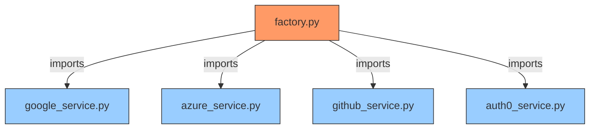
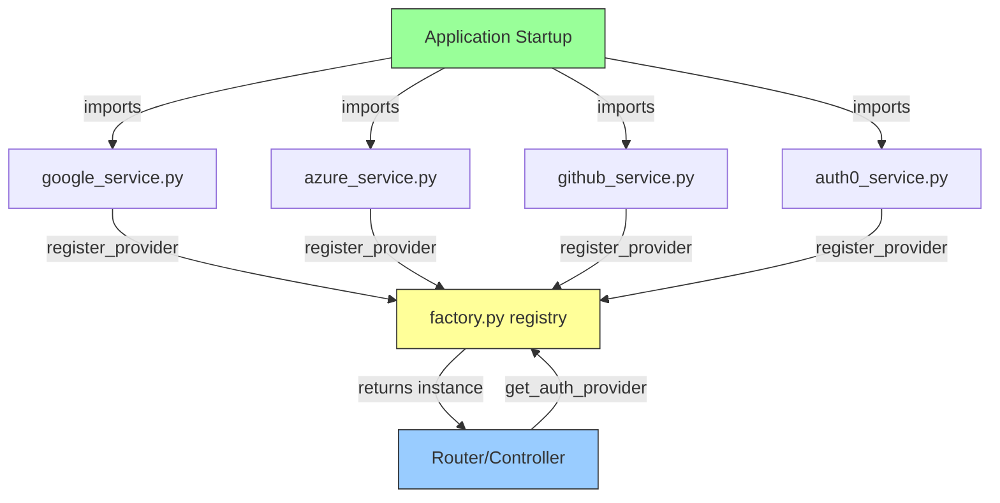
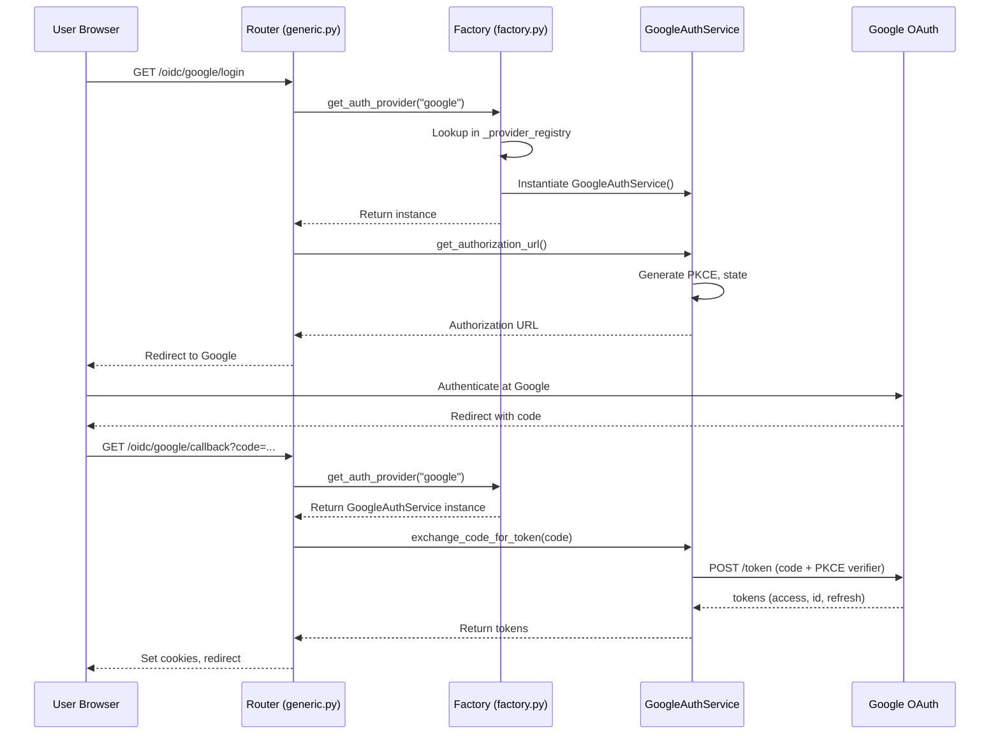
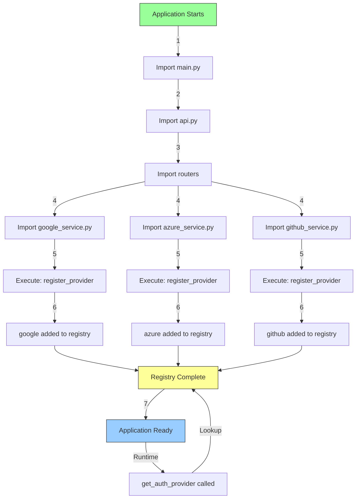

# Factory Pattern & Provider Registration

## What is `register_provider` doing?

The `register_provider()` function implements the **Registry Pattern** (a variant of the Factory Pattern) for dynamic provider management in this authentication system.

```python
def register_provider(name: str, provider_class: type[BaseAuthProvider]) -> None:
    """Register an authentication provider with the factory."""
    _provider_registry[name.lower()] = provider_class
```

### What it does:
1. **Stores provider classes** in a central registry (`_provider_registry` dictionary)
2. **Maps provider names** (e.g., "google", "github") to their implementation classes
3. **Enables dynamic instantiation** - providers can be created at runtime by name

---

## Why Explicit Registration is Needed?

### The Problem Without Registration



**Issues:**
- ❌ **Tight Coupling**: Factory must know about all providers
- ❌ **Import Overhead**: All providers loaded even if unused
- ❌ **Modification Required**: Adding new provider requires editing factory
- ❌ **Circular Dependencies**: Risk of import cycles

### The Solution With Registration



**Benefits:**
- ✅ **Loose Coupling**: Factory doesn't import providers
- ✅ **Lazy Loading**: Providers loaded only when needed
- ✅ **Extensibility**: New providers self-register without factory changes
- ✅ **No Circular Dependencies**: One-way dependency flow

---

## How It Works: Step-by-Step

### Step 1: Provider Self-Registration

Each provider service registers itself when imported:

```python
# google_service.py
class GoogleAuthService(BaseAuthProvider):
    def __init__(self):
        # ... initialization ...
        pass
    
    @property
    def provider_name(self) -> str:
        return "google"
    
    # ... other methods ...

# Self-registration at module level (runs on import)
register_provider("google", GoogleAuthService)
```

**When does this run?**
- When the module is first imported
- Typically during application startup
- Only once per application lifecycle

### Step 2: Factory Storage

The factory maintains a simple registry:

```python
# factory.py
_provider_registry: dict[str, type[BaseAuthProvider]] = {}

def register_provider(name: str, provider_class: type[BaseAuthProvider]) -> None:
    _provider_registry[name.lower()] = provider_class
```

After all imports:
```python
_provider_registry = {
    "google": GoogleAuthService,
    "azure": AzureAuthService,
    "github": GitHubAuthService,
    "auth0": Auth0AuthService,
}
```

### Step 3: Dynamic Provider Retrieval

When you need a provider:

```python
# factory.py
def get_auth_provider(provider: str | None = None) -> BaseAuthProvider:
    settings = get_settings()
    provider_name = provider.lower() if provider else settings.auth_provider.value
    
    if provider_name not in _provider_registry:
        raise ProviderNotSupportedError(provider_name)
    
    return _provider_registry[provider_name]()  # Instantiate and return
```

---

## Real-World Flow Example

### Scenario: User logs in with Google



---

## Comparison: With vs Without Registration

### ❌ Without Registration (Hard-coded Factory)

```python
# factory.py - BAD APPROACH
from src.fastapi.services.auth.google_service import GoogleAuthService
from src.fastapi.services.auth.azure_service import AzureAuthService
from src.fastapi.services.auth.github_service import GitHubAuthService
from src.fastapi.services.auth.auth0_service import Auth0AuthService

def get_auth_provider(provider: str) -> BaseAuthProvider:
    if provider == "google":
        return GoogleAuthService()
    elif provider == "azure":
        return AzureAuthService()
    elif provider == "github":
        return GitHubAuthService()
    elif provider == "auth0":
        return Auth0AuthService()
    else:
        raise ValueError(f"Unknown provider: {provider}")
```

**Problems:**
- Must import ALL providers (even unused ones)
- Must modify factory for each new provider
- Tight coupling between factory and providers
- All provider dependencies loaded at startup

### ✅ With Registration (Current Approach)

```python
# factory.py - GOOD APPROACH
_provider_registry: dict[str, type[BaseAuthProvider]] = {}

def register_provider(name: str, provider_class: type[BaseAuthProvider]) -> None:
    _provider_registry[name.lower()] = provider_class

def get_auth_provider(provider: str) -> BaseAuthProvider:
    if provider not in _provider_registry:
        raise ProviderNotSupportedError(provider)
    return _provider_registry[provider]()

# Each provider service:
# register_provider("google", GoogleAuthService)
```

**Benefits:**
- Factory doesn't import providers
- Add new provider by creating service file only
- Providers register themselves
- Load only what you need

---

## Where Registration Happens in Your Code

### 1. Google Service
```python
# src/fastapi/services/auth/google_service.py
class GoogleAuthService(BaseAuthProvider):
    # ... implementation ...
    pass

register_provider("google", GoogleAuthService)  # Line 109
```

### 2. Azure Service
```python
# src/fastapi/services/auth/azure_service.py
class AzureAuthService(BaseAuthProvider):
    # ... implementation ...
    pass

register_provider("azure", AzureAuthService)  # Line 123
```

### 3. GitHub Service
```python
# src/fastapi/services/auth/github_service.py
class GitHubAuthService(BaseAuthProvider):
    # ... implementation ...
    pass

register_provider("github", GitHubAuthService)  # Line 93
```

### 4. Auth0 Service
```python
# src/fastapi/services/auth/auth0_service.py
class Auth0AuthService(BaseAuthProvider):
    # ... implementation ...
    pass

register_provider("auth0", Auth0AuthService)  # Line 227
```

---

## When Registration Happens



**Timeline:**
1. **App startup** - FastAPI imports modules
2. **Module import** - Each service file is imported
3. **Registration** - `register_provider()` called at module level
4. **Registry populated** - All providers available
5. **Runtime** - `get_auth_provider()` looks up providers

---

## Alternative Approaches (Why We Don't Use Them)

### 1. ❌ Decorator-Based Registration

```python
# Looks cleaner but has issues
@register_provider("google")
class GoogleAuthService(BaseAuthProvider):
    pass
```

**Problems:**
- Harder to debug (decorators hide behavior)
- Import side-effects less visible
- Doesn't work well with type checkers

### 2. ❌ Manual Registry in __init__.py

```python
# src/fastapi/services/auth/__init__.py
from .google_service import GoogleAuthService
from .azure_service import AzureAuthService
# ... import all providers ...

_registry = {
    "google": GoogleAuthService,
    "azure": AzureAuthService,
}
```

**Problems:**
- Still requires importing all providers
- Centralized registry defeats the purpose
- Tight coupling remains

### 3. ✅ Current Approach (Self-Registration)

```python
# Each service file
register_provider("google", GoogleAuthService)
```

**Why it's best:**
- Clear and explicit
- No magic or hidden behavior
- Easy to debug (grep for "register_provider")
- Type-safe
- Self-documenting

---

## Configuration-Driven Provider Selection

The registration pattern enables configuration-based provider selection:

### Environment Variables
```bash
# .env file
AUTH_PROVIDER=google  # Default provider
```

### Settings Class
```python
# src/core/settings/app.py
class Settings(BaseSettings):
    auth_provider: AuthProvider = AuthProvider.GOOGLE
```

### Factory Usage
```python
# Use default from settings
provider = get_auth_provider()  # Returns GoogleAuthService

# Or override explicitly
provider = get_auth_provider("azure")  # Returns AzureAuthService
```

### Router Usage
```python
# src/fastapi/routers/auth/generic.py
def _get_service(provider: AuthProvider) -> BaseAuthProvider:
    # Could use factory, but this router uses direct imports for clarity
    services = {
        AuthProvider.GITHUB: GitHubAuthService,
        AuthProvider.AZURE: AzureAuthService,
        AuthProvider.GOOGLE: GoogleAuthService,
        AuthProvider.AUTH0: Auth0AuthService,
    }
    return services[provider]()
```

**Note:** Your routers currently import providers directly for clarity in the comparison demo. In production, you'd use `get_auth_provider()` everywhere.

---

## Benefits Summary

| Aspect | Without Registration | With Registration |
|--------|---------------------|-------------------|
| **Coupling** | Tight (factory imports all) | Loose (providers self-register) |
| **Extensibility** | Modify factory for each provider | Add provider file only |
| **Loading** | All providers at startup | Lazy loading possible |
| **Dependencies** | Risk of circular imports | One-way dependency |
| **Testability** | Hard to mock | Easy to inject test providers |
| **Discovery** | Manual mapping | Automatic registration |
| **Type Safety** | ✅ Yes | ✅ Yes |
| **Debuggability** | Hard to trace | Easy to grep |

---

## Adding a New Provider

With the registration pattern, adding a provider is simple:

### Step 1: Create Service File
```python
# src/fastapi/services/auth/new_provider_service.py
from src.core.auth.base import BaseAuthProvider
from src.core.auth.factory import register_provider

class NewProviderAuthService(BaseAuthProvider):
    @property
    def provider_name(self) -> str:
        return "newprovider"
    
    # Implement required methods...
    pass

# Self-register
register_provider("newprovider", NewProviderAuthService)
```

### Step 2: Import Somewhere
```python
# src/fastapi/api.py or wherever
from src.fastapi.services.auth.new_provider_service import NewProviderAuthService
```

### Step 3: Use It
```python
provider = get_auth_provider("newprovider")
```

**That's it!** No factory modifications needed.

---

## Conclusion

**`register_provider()` is needed because:**

1. ✅ **Decouples** factory from provider implementations
2. ✅ **Enables** adding providers without modifying core code
3. ✅ **Prevents** circular import issues
4. ✅ **Supports** dynamic provider selection at runtime
5. ✅ **Allows** lazy loading of provider dependencies
6. ✅ **Makes** testing easier (mock providers)
7. ✅ **Follows** Open/Closed Principle (open for extension, closed for modification)

The explicit `register_provider("google", GoogleAuthService)` call at the bottom of each service file is a **design choice** that trades a small amount of boilerplate for significant architectural benefits.

---

## Further Reading

- **Factory Pattern**: https://refactoring.guru/design-patterns/factory-method
- **Registry Pattern**: https://martinfowler.com/eaaCatalog/registry.html
- **Dependency Injection**: https://fastapi.tiangolo.com/tutorial/dependencies/
- **Python Import System**: https://docs.python.org/3/reference/import.html

