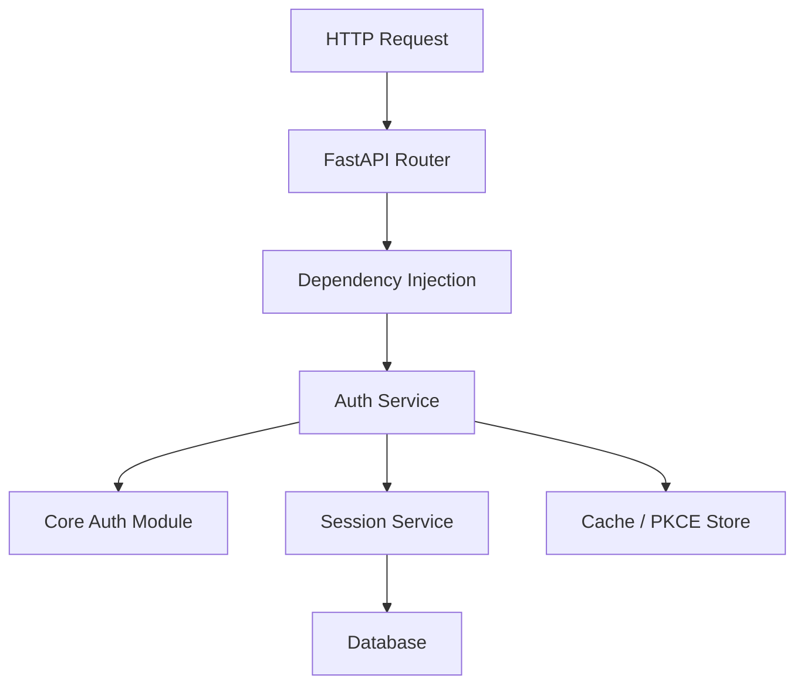
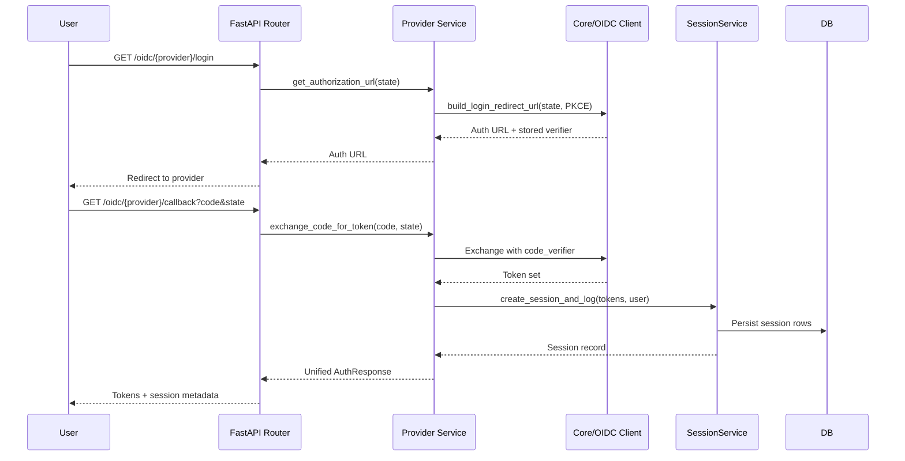
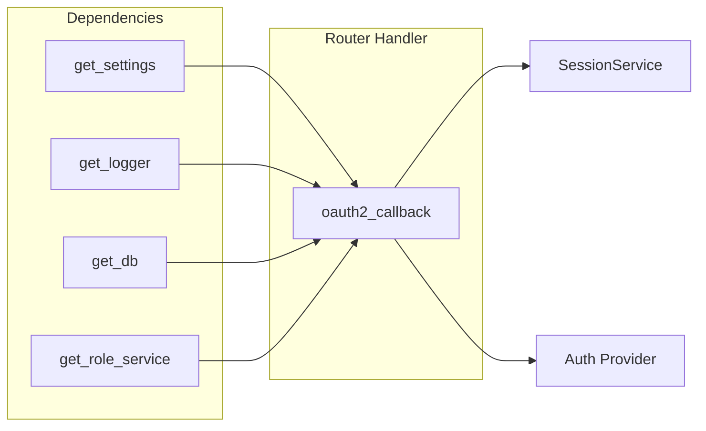
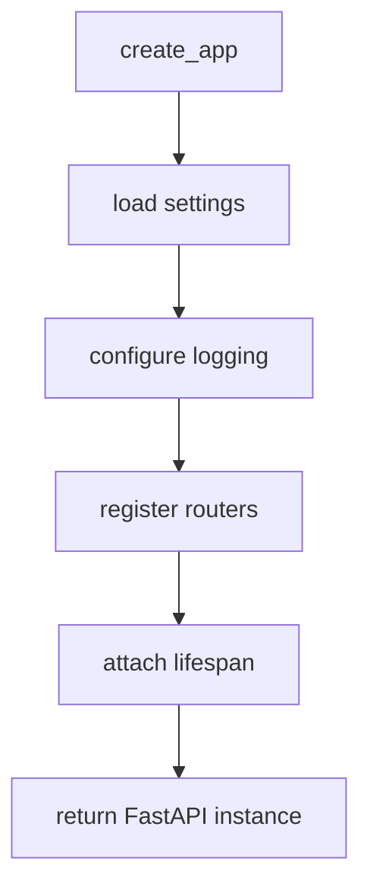

# FastAPI Design & Implementation Guide

This document describes how the FastAPI layer in this project is structured, how requests traverse routers, services, and utilities, and what core platform features ship out of the box. Use it as a blueprint when extending the API surface or onboarding new contributors.

---

## 1. Architectural Overview

| Layer | Location | Responsibilities |
|-------|----------|------------------|
| **API Entrypoint** | `fastapi/main.py` | Application factory, lifespan hooks, router registration, logging wiring |
| **Routers** | `fastapi/routers/` (`auth/*.py`, `root.py`) | HTTP endpoints, request validation, dependency injection of services/loggers/DB |
| **Services** | `fastapi/services/` (`auth/`, `database/`) | Provider-specific logic, token handling, PKCE-aware flows, session persistence |
| **Utilities** | `fastapi/utilities/` | Shared helpers for DB access, session logging, authorization, HTTP clients |
| **Core Auth** | `src/core/auth/` | Provider abstractions, PKCE store, generic OIDC client, token validators |
| **Settings & Config** | `src/core/settings/app.py` | Environment-driven configuration, provider secrets, feature toggles |

---

## 2. Request Lifecycle

The following sequence diagram illustrates a typical OAuth/OIDC login handled by the generic router (`fastapi/routers/auth/generic.py`).

Key points:
- **State binding & PKCE**: `GenericOIDCClient` stores the verifier via `core/auth/pkce_store.py` and retrieves it during token exchange.
- **Session logging**: `fastapi/utilities/session_helpers.py` enriches logs with IP, user agent, provider, and stores hashed tokens through `SessionService` (`fastapi/services/database/session_service.py`).
- **Error handling**: `OAuth2CallbackError` exceptions are translated into HTTP 4xx/5xx responses with provider-specific context.

---

## 3. Router & Dependency Design

Routers leverage FastAPI dependencies to keep handlers declarative and testable.

- **`get_settings()`**: singleton settings object injected everywhere to avoid repeated parsing.
- **`get_db()`**: yields a SQLModel `Session`, ensuring connection lifecycle is tied to request scope.
- **`get_logger()`**: structured logger with request ID correlation.
- **`get_role_service()`**: maps provider attributes (e.g., GitHub orgs, Azure groups) to internal roles.

Routers remain thin: they orchestrate dependencies, call into services, and translate results into response models defined under `fastapi/models/auth/`.

---

## 4. Core Features Implemented

| Feature | Description | Key Modules |
|---------|-------------|-------------|
| **OAuth2 & OIDC flows** | Unified routers for `/oauth2/{provider}` and `/oidc/{provider}` showing protocol differences | `fastapi/routers/auth/generic.py`, `core/auth/oidc_client.py` |
| **PKCE Everywhere** | Automatic code verifier generation, secure storage with TTL, one-time retrieval | `core/auth/pkce_store.py`, `core/auth/oidc_client.py` |
| **Session Tracking** | Persists hashed access/refresh tokens, timestamps, IPs, devices; exposes admin queries | `fastapi/services/database/session_service.py`, `fastapi/models/database/session_models.py` |
| **Provider Abstraction** | Factory + base class pattern for Azure, Google, Auth0, GitHub | `core/auth/base.py`, `core/auth/factory.py`, `fastapi/services/auth/*.py` |
| **Role Mapping** | Derives roles from provider attributes (Azure groups, GitHub orgs) | `fastapi/services/auth/role_service.py` |
| **Structured Logging** | Custom logger dependency with JSON logs, correlation IDs | `core/configuration/custom_logger.py`, `fastapi/utilities/session_helpers.py` |
| **Cache Layer** | In-memory cache for PKCE verifiers and other ephemeral artifacts | `core/cache/memory_cache.py` |
| **Security Middleware** | Bearer auth helpers, token validation utilities | `core/auth/security.py`, `fastapi/utilities/authorization.py` |

---

## 5. Feature Deep Dive

### 5.1 OAuth2 vs OIDC Comparison Router
- Endpoint: `fastapi/routers/auth/generic.py`
- Provides `/providers`, `/oauth2/{provider}/login`, `/oidc/{provider}/login`, and callbacks.
- Demonstrates contrasts (access token only vs full OpenID token set) to help teams select the right protocol per provider.

### 5.2 Session Service
- File: `fastapi/services/database/session_service.py`
- Responsibilities:
  - Create and invalidate sessions tied to bearer tokens
  - Flag concurrent logins
  - Provide administrative queries (active sessions, token revocation)
- Integrates with SQLModel models in `fastapi/models/database/session_models.py`.

### 5.3 Role Service
- File: `fastapi/services/auth/role_service.py`
- Maps provider signals to internal roles:
  - Azure AD: security groups, tenant IDs
  - GitHub: organizations, teams
  - Google/Auth0: email domains, custom claims
- Exposes helpers used by routers to embed roles in `AuthResponse` payloads.

### 5.4 Logging & Observability
- `fastapi/utilities/session_helpers.py` centralizes audit logging for login success/failure and logout events.
- `core/configuration/logger_dependency.py` injects a configured logger that attaches request metadata.
- Logs include state IDs, provider names, IP addresses, and hashed token fingerprints for traceability.

### 5.5 Provider Services
Each provider service (Azure, Google, Auth0, GitHub) extends `BaseAuthProvider` to ensure consistent interfaces:
- `get_authorization_url`
- `exchange_code_for_token`
- `get_user_info` / `get_user_from_token`
- Optional `refresh_token` helpers

Services encapsulate provider quirks (e.g., Azure `prompt=consent`, Google `access_type=offline`, Auth0 audiences, GitHub extra REST calls).

---

## 6. FastAPI Lifespan & App Factory

`fastapi/main.py` exposes a `create_app()` factory that:
1. Loads settings
2. Configures logging & middleware
3. Registers routers (`api.include_router(...)`)
4. Sets up lifespan handlers for startup/shutdown tasks (e.g., database migrations, cache warm-up)

This pattern makes the app easy to test (import `create_app` in pytest) and deploy (Uvicorn/Gunicorn call `create_app`).

---

## 7. Extending the FastAPI Layer

When adding a new provider or feature:
1. **Define provider service** under `fastapi/services/auth/` extending `BaseAuthProvider` and register it via `core/auth/factory.register_provider`.
2. **Expose routes** in `fastapi/routers/auth/` (or a new router) and include them in `fastapi/api.py`.
3. **Update models** in `fastapi/models/` if new response shapes are needed.
4. **Leverage utilities** (`session_helpers`, `authorization`) for consistent logging and security.
5. **Document** the addition in `PROVIDER_IMPLEMENTATIONS.md` or related guides.

Following this blueprint keeps the FastAPI surface thin, secure, and maintainable.
