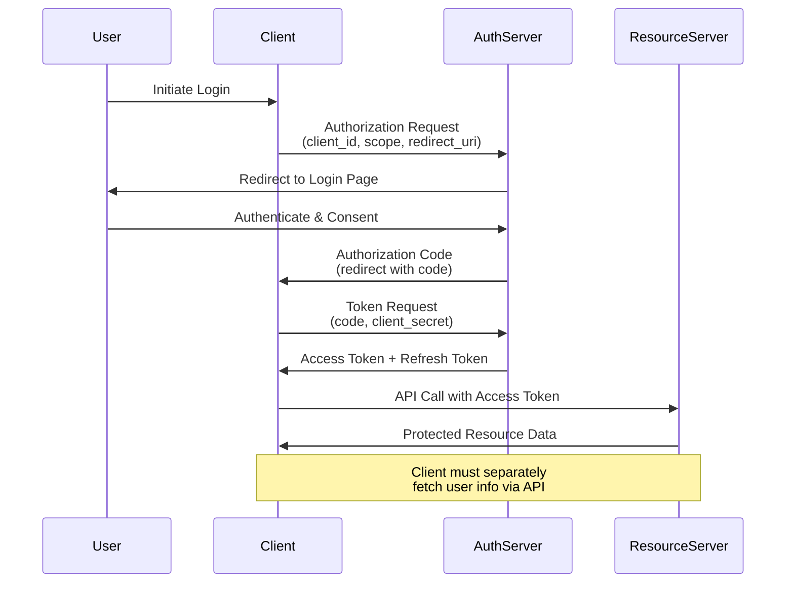
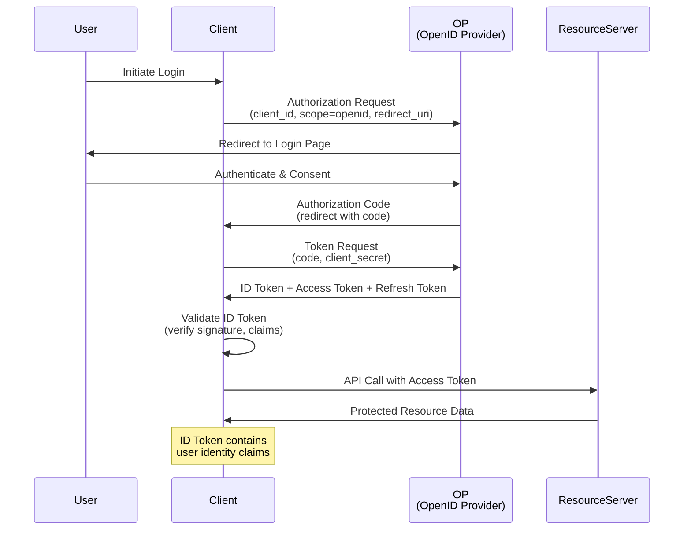
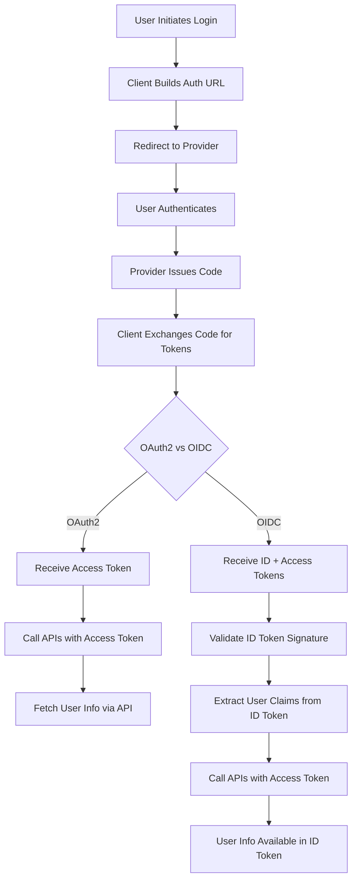
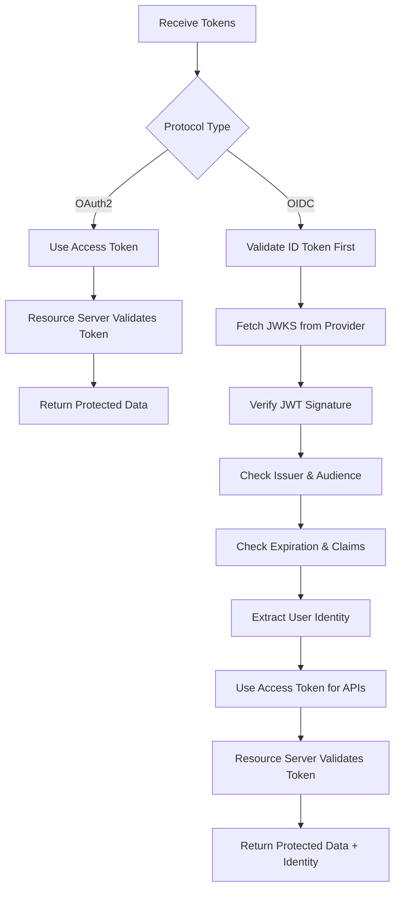
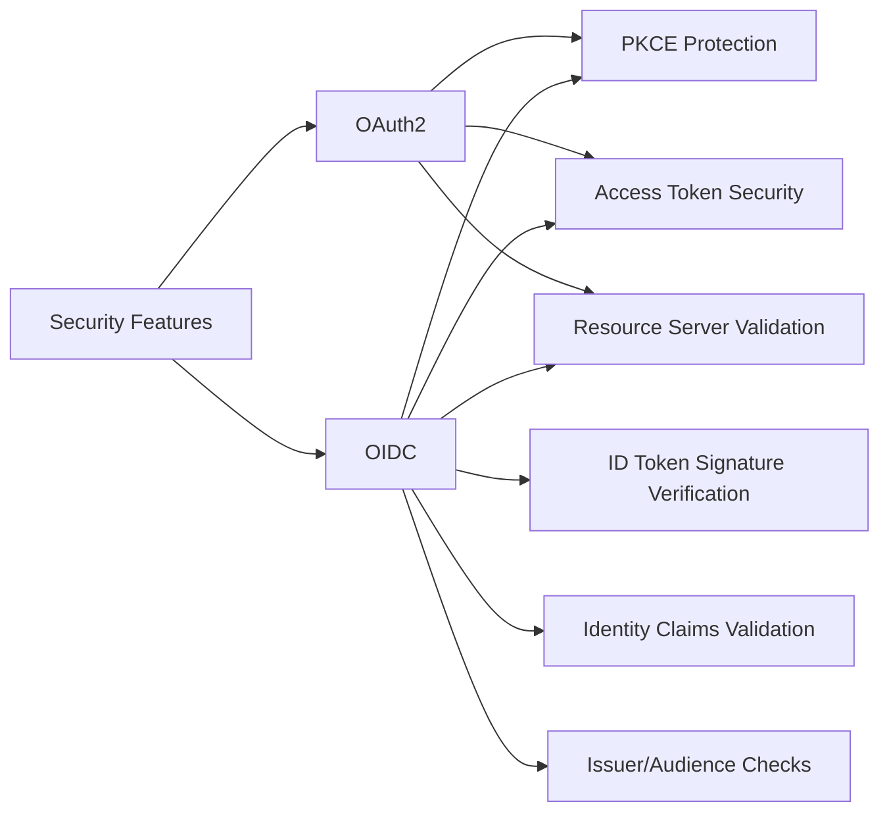
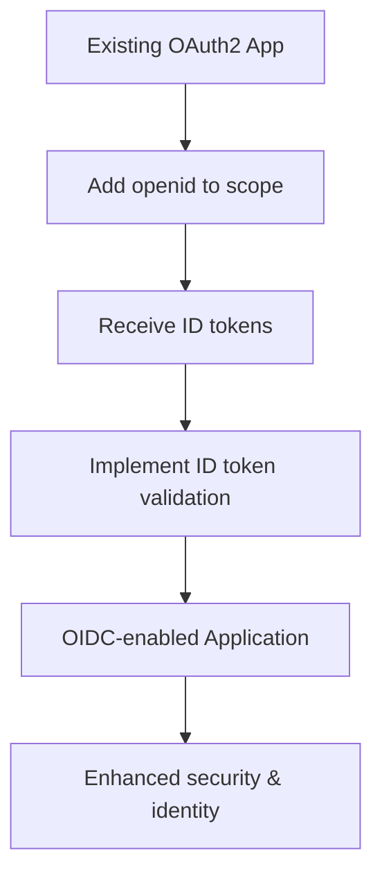

# OIDC vs OAuth2 Authentication Flows

This document explains the differences between OAuth2 and OIDC (OpenID Connect) authentication flows as implemented in the core/auth module. Both protocols are built on top of each other, with OIDC extending OAuth2 for identity information.

## OAuth2 Authorization Code Flow

OAuth2 provides delegated access without identity information. The client gets access tokens for API calls but must separately fetch user information.

### OAuth2 Flow Diagram



### OAuth2 Implementation in Code

```python
# From oidc_client.py - OAuth2 token exchange
async def exchange_code_for_token(self, code: str, state: str | None = None) -> dict[Any, Any]:
    data = {
        "grant_type": "authorization_code",
        "code": code,
        "client_id": self.client_id,
        "client_secret": self.client_secret,
        "redirect_uri": self.redirect_uri,
    }
    # Token response: {"access_token": "...", "refresh_token": "..."}
```

### OAuth2 Characteristics

- **Scope**: Limited to resource access (e.g., "read", "write")
- **Tokens**: Access token + optional refresh token
- **Identity**: No built-in user identity information
- **User Info**: Requires separate API calls to identity provider
- **Use Case**: API authorization, not authentication

## OIDC Authorization Code Flow

OIDC extends OAuth2 with identity information. The client receives ID tokens containing user claims, plus access tokens for API calls.

### OIDC Flow Diagram



### Examples for Azure and GitHub

**Note**: In OAuth2/OIDC terminology, the "Client" refers to your application (web app, mobile app, or service) that initiates the authentication flow and requests access to resources on behalf of the user.

#### Azure AD Example
- **User**: An employee with an Azure AD account (e.g., user@company.onmicrosoft.com)
- **Client**: A web application registered in Azure AD (e.g., a React SPA or .NET web app)
- **OP (OpenID Provider)**: Azure Active Directory (https://login.microsoftonline.com)
- **ResourceServer**: Microsoft Graph API (https://graph.microsoft.com) or Azure-protected APIs

#### GitHub Example  
- **User**: A developer with a GitHub account (e.g., octocat@github.com)
- **Client**: A GitHub OAuth App registered in developer settings
- **OP (OpenID Provider)**: GitHub (https://github.com)
- **ResourceServer**: GitHub REST API (https://api.github.com) or GitHub-protected resources

### OIDC Implementation in Code

```python
# From oidc_client.py - OIDC token exchange
async def exchange_code_for_token(self, code: str, state: str | None = None) -> dict[Any, Any]:
    # Same as OAuth2, but scope includes "openid"
    data = {
        "grant_type": "authorization_code",
        "code": code,
        "client_id": self.client_id,
        "client_secret": self.client_secret,
        "redirect_uri": self.redirect_uri,
        "scope": "openid profile email",  # Includes openid
    }
    # Token response: {"id_token": "...", "access_token": "...", "refresh_token": "..."}

# From oidc_token_validator.py - ID Token validation
async def validate_token(self, token: str) -> dict[str, Any]:
    # Verify signature using JWKS
    # Validate issuer, audience, expiration
    # Return decoded claims
```

### OIDC Characteristics

- **Scope**: Always includes "openid" plus optional scopes
- **Tokens**: ID token + access token + optional refresh token
- **Identity**: ID token contains verified user identity claims
- **User Info**: Built-in via ID token, optional UserInfo endpoint
- **Use Case**: User authentication with identity information

## Key Differences: OAuth2 vs OIDC

| Aspect | OAuth2 | OIDC |
|--------|--------|------|
| **Primary Purpose** | API Authorization | User Authentication |
| **Scope Parameter** | Resource scopes (read, write) | Includes "openid" |
| **Identity Info** | Separate API calls required | ID token with claims |
| **Token Types** | Access + Refresh | ID + Access + Refresh |
| **User Verification** | Not applicable | ID token signature verification |
| **Standard** | RFC 6749 | Built on OAuth2 + additional specs |
| **User Experience** | Same login flow | Same login flow |

### Flow Comparison Diagram



## Token Validation Differences

### OAuth2 Token Validation
- **Access Tokens**: Opaque or JWT, validated by resource server
- **No Identity Validation**: Client trusts the access token
- **Scope Checking**: Resource server validates token scope

### OIDC Token Validation
- **ID Tokens**: Always JWT, validated by client using JWKS
- **Signature Verification**: Cryptographic verification using provider's public keys
- **Claims Validation**: Issuer, audience, expiration, nonce
- **Identity Assurance**: Client can trust user identity from validated ID token

### Validation Flow Diagram



## Implementation in Core/Auth Module

### Shared Components
- **oidc_client.py**: Handles both OAuth2 and OIDC token exchanges
- **pkce_store.py**: PKCE security for both protocols
- **http_client.py**: HTTP transport layer
- **security.py**: Security utilities

### OIDC-Specific Components
- **oidc_token_validator.py**: ID token validation with JWKS
- **base.py**: Base authentication provider interfaces

### Protocol Detection
The implementation automatically detects protocol based on scope:

```python
# If scope includes "openid", it's OIDC
if "openid" in scope:
    # OIDC flow: expect ID token
    tokens = await client.exchange_code_for_token(code)
    id_token = tokens.get("id_token")
    if id_token:
        validator = OIDCTokenValidator(...)
        claims = await validator.validate_token(id_token)
else:
    # OAuth2 flow: access token only
    tokens = await client.exchange_code_for_token(code)
    access_token = tokens.get("access_token")
```

## Security Considerations

### OAuth2 Security
- **Token Security**: Access tokens must be protected
- **No Identity Verification**: Client cannot verify user identity
- **Man-in-the-Middle**: Vulnerable without PKCE

### OIDC Security
- **ID Token Verification**: Cryptographic signature validation
- **Claims Validation**: Issuer, audience, expiration checks
- **PKCE Protection**: Same as OAuth2
- **Identity Assurance**: Verified user identity

### Security Comparison



## Use Cases and Recommendations

### When to Use OAuth2
- **API Authorization**: Granting access to resources
- **No Identity Needed**: Pure resource access scenarios
- **Legacy Systems**: Existing OAuth2 implementations
- **Mobile Apps**: Where identity verification isn't critical

### When to Use OIDC
- **User Authentication**: Login and identity verification
- **Single Sign-On**: Consistent identity across applications
- **Modern Web Apps**: SPAs and mobile apps needing user info
- **Enterprise Apps**: Where verified identity is required

### Migration Path


This implementation provides a smooth transition from OAuth2 to OIDC by extending the existing OAuth2 infrastructure with identity capabilities.
